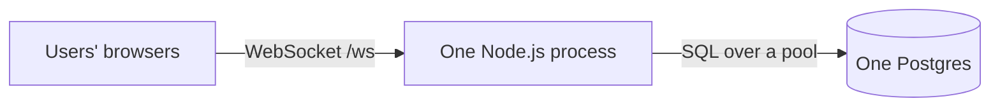

# Stage 00 Chat: Code Walkthrough (line by line, and the *why*)

This is your learning companion. The existing `README.md` tells you how to *run*
the project. This file explains **how we built it, why we made each decision,
what questions we asked about real users, and what would happen if those
situations came up.**

It is the continuation of `../docs/chat-learning-journey/00-stage-50-100-users.md`.
That doc taught the *idea* (one server + one Postgres, three tables). This file
is the *code* that turns the idea into something runnable, and it goes deeper
into every best practice we baked in.

---

## 0. The mental model before any code

Before writing a single line, we asked ourselves the beginner-trap question:

> "We have 50-100 users. Do we need Redis? Queues? Microservices? Sharding?"

Answer: **No.** 100 open connections is a few MB of RAM. A few messages per
second is nothing for one Postgres. Adding those tools now would give us more
things to install, monitor, and break, solving problems we do not have.

So the whole architecture is one picture:



But "simple" is not the same as "sloppy." We decided that even at 100 users we
would do the *fundamentals* correctly, because those habits are what let the
same codebase grow later without a rewrite. Every "best practice" below was
chosen to be cheap now and valuable later.

### The message flow we are implementing (memorize this)

1. Alice's browser holds a WebSocket to the server.
2. She sends `hi`. The server receives the raw text.
3. Server **validates** it, **authorizes** it (is Alice in this conversation?).
4. Server does **one** durable thing: `INSERT` the message into Postgres.
5. Server **acks** Alice (so her UI can show "sent").
6. Server looks up the other members (Bob) and, if Bob is connected *to this
   server*, pushes the message down Bob's socket.
7. Done. No queue, no fan-out workers, because the job is tiny.

Everything in `src/` exists to do those 7 steps safely.

---

## 1. Project structure (why each folder exists)

```
migrations/001_init.sql   the database schema + the exact indexes our queries need
src/
  lib/                    cross-cutting basics (config, logging, auth) - no business logic
    config.ts             validated environment variables (fail fast)
    logger.ts             structured JSON logging
    auth.ts               tiny signed-token auth (a JWT stand-in)
  db/                     everything about the database
    pool.ts               one shared connection pool + query/transaction helpers
    migrate.ts            forward-only migration runner
    repo.ts               ALL the SQL lives here (users, conversations, messages)
  ws/                     the real-time WebSocket layer
    protocol.ts           the "wire format" - what messages look like, validated by zod
    registry.ts           in-memory "who is online" map (the Stage 03 upgrade point)
    hub.ts                connection lifecycle: auth, heartbeat, rate limit, send/history
  http/
    server.ts             small HTTP API: /health, /register, /conversations/direct
  index.ts                composition root: wires it all together + graceful shutdown
scripts/                  learning/ops tools (seed, benchmark, smoke test)
```

**The key design principle: separation of concerns.** Each file has one job.
- `repo.ts` is the *only* place that writes SQL. If a query is slow, you know
  exactly where to look.
- `registry.ts` is the *only* place that assumes "one server." When we go
  multi-server in Stage 03, we change one file, not the whole app.
- `lib/` has no knowledge of chat at all. It is reusable plumbing.

This is not over-engineering. It is drawing lines so that future-you can find
things and change one thing without breaking five others.

---

## 2. The database schema: `migrations/001_init.sql`

This is where we start, because the data model is the skeleton everything hangs
on. Read the file alongside this.

### Why ULIDs for `id` instead of auto-increment integers?

```sql
id  TEXT PRIMARY KEY,  -- ULID
```

A ULID is a 26-character string that is **globally unique** AND
**time-sortable** (the front of the string encodes the timestamp). Two payoffs:

1. **"Newest first" is free.** Sorting by `id DESC` is the same as sorting by
   time. We do not need a separate index on `created_at` for the hot query.
2. **No central counter bottleneck later.** Auto-increment integers are handed
   out by a single sequence in one database. When we shard across many
   databases in Stage 04, that single counter becomes a problem. ULIDs are
   generated in the app, so any server can mint one with zero coordination.

*Question we asked:* "What if two servers generate an id at the same
millisecond?" ULID handles this with random bits after the timestamp, so
collisions are effectively impossible.

### The three-and-a-half tables

- **users**: who can log in. `username` is `UNIQUE` so two people cannot claim
  the same handle.
- **conversations**: a chat "room." `type` is `CHECK`-constrained to
  `'direct'` or `'group'`. The database itself refuses a bad value. That is a
  guardrail you get for free.
- **conversation_members**: the join table. This is the one genuinely
  "advanced" idea in Stage 00.
- **messages**: the actual chat lines.

### Why a separate `conversation_members` table (the many-to-many)?

A conversation has many users; a user is in many conversations. That is a
**many-to-many** relationship. The wrong beginner instinct is to store a list
of member ids in a column on `conversations`. The moment you ask "which
conversations is Alice in?" that design forces you to scan every row and parse
arrays. A join table answers it with a simple indexed lookup.

```sql
CREATE TABLE conversation_members (
  conversation_id TEXT REFERENCES conversations(id) ON DELETE CASCADE,
  user_id         TEXT REFERENCES users(id) ON DELETE CASCADE,
  ...
  PRIMARY KEY (conversation_id, user_id)   -- a user can't be added twice
);
```

- `REFERENCES ... ON DELETE CASCADE`: if a conversation is deleted, its
  membership rows delete themselves automatically. No orphan rows. This is a
  **foreign key**, and it keeps the data honest even if our app code has a bug.
- `PRIMARY KEY (conversation_id, user_id)`: the pair must be unique. You cannot
  accidentally add the same person to the same room twice.

### The `direct_key` trick (preventing duplicate 1:1 chats)

```sql
direct_key TEXT UNIQUE,  -- sorted pair of user ids, e.g. "userA:userB"
```

*Question we asked:* "What if Alice starts a chat with Bob, and at the same
moment Bob starts a chat with Alice? Do we get two separate 1:1 rooms?"

Without protection, yes, that race would create duplicates. Our fix: for a
direct chat we compute a canonical key by sorting the two ids and joining them.
`[alice, bob].sort().join(':')` is the same whether Alice or Bob initiates.
Then `UNIQUE` on that column means the database physically cannot store two.
The second attempt loses and reuses the first room. Correctness enforced by the
database, not by hopeful app code.

### The indexes (this is the heart of the performance lesson)

```sql
-- 01. Idempotency
CREATE UNIQUE INDEX uq_messages_conv_clientid
  ON messages (conversation_id, client_msg_id);

-- 02. THE hot-query index
CREATE INDEX ix_messages_conv_id_desc
  ON messages (conversation_id, id DESC);

-- 03. "which conversations is this user in?"
CREATE INDEX ix_members_user
  ON conversation_members (user_id);
```

Index 02 is the one to understand deeply. Our most frequent query is:

```sql
SELECT ... FROM messages
WHERE conversation_id = $1 [AND id < $cursor]
ORDER BY id DESC LIMIT $n
```

An index on `(conversation_id, id DESC)` lets Postgres **jump** straight to the
right conversation, already in the right order, and read just `$n` rows. No
scanning, no sorting.

*The trap question we specifically wanted to answer:* "We only ever show ~50
messages (`LIMIT 50`). How could that ever be slow?" See Section 8, it is the
best lesson in this project.

We deliberately did **not** add speculative indexes ("might need this someday").
Every index costs write time and disk. We added exactly the three our queries
need. When a new hot query appears, we will add its index then, guided by the
slow-query log (Section 4).

---

## 3. `src/lib/` - the plumbing

### `config.ts` - fail fast on bad configuration

```ts
const schema = z.object({
  PORT: z.coerce.number().int().positive().default(3000),
  DATABASE_URL: z.string().url().or(z.string().startsWith('postgres')),
  AUTH_SECRET: z.string().min(8, 'AUTH_SECRET must be at least 8 chars'),
  ...
});
const parsed = schema.safeParse(process.env);
if (!parsed.success) { console.error(...); process.exit(1); }
```

We read all environment variables through one validated schema (using `zod`).

*Question we asked:* "What if someone deploys with a missing `DATABASE_URL` or
a 3-character `AUTH_SECRET`?" Without validation, the app would start and then
crash mysteriously on the first query, or run with insecure config. With this,
it **refuses to start** and prints exactly what is wrong. Failing at boot is
much cheaper than failing at 3am under load.

`z.coerce.number()` is important: environment variables are always strings, so
`"3000"` gets coerced to the number `3000`. `.default(...)` means sensible
values if the var is absent.

### `logger.ts` - structured logging from day one

```ts
export const logger = pino({ level: config.LOG_LEVEL });
```

We log **structured JSON**, not `console.log("user connected " + id)`. Why care
at 100 users? Because when we grow, we will ship logs to an aggregator
(Datadog, Loki, etc.) that can filter `userId=...` only if the logs are
structured. Establishing the habit now costs nothing and avoids a
find-and-replace rewrite later. We log to stdout (the "12-factor" way) and let
the container/supervisor collect it.

### `auth.ts` - a deliberately tiny token scheme

```ts
function sign(userId) { return createHmac('sha256', AUTH_SECRET).update(userId).digest('base64url'); }
export function issueToken(userId) { return `${userId}.${sign(userId)}`; }
```

A token is `userId.signature`. The signature is an HMAC (a keyed hash) of the
user id using our secret. Only the server knows the secret, so only the server
can produce a valid signature.

*Question we asked:* "What if a user just edits their token to claim someone
else's id?" They would change `userId` but could not produce the matching
signature without the secret, so `verifyToken` returns `null` and we reject
them.

```ts
return timingSafeEqual(a, b) ? userId : null;
```

Note `timingSafeEqual`, not `a === b`. A normal string compare returns faster
when the first character differs, and an attacker can measure those tiny timing
differences to guess a signature byte by byte. A **constant-time** compare
removes that side channel. This is a real habit worth internalizing.

**Honest limitation we chose on purpose:** this token has no expiry and is not
a full JWT. That is fine for Stage 00 (keeps us dependency-light and focused on
the chat mechanics). The architecture docs replace it with short-lived JWTs
from a real auth service by Stage 03. The *habit* we lock in now is the one that
matters: **the server verifies identity on connect and authorizes every action;
it never trusts a client-supplied user id.**

---

## 4. `src/db/` - talking to Postgres safely

### `pool.ts` - one shared connection pool

```ts
export const pool = new Pool({
  connectionString: config.DATABASE_URL,
  max: config.PG_POOL_MAX,           // default 10
  idleTimeoutMillis: config.PG_POOL_IDLE_MS,
  statement_timeout: config.PG_STATEMENT_TIMEOUT_MS, // default 5000ms
});
```

Opening a Postgres connection is **expensive** (a TCP handshake, auth, backend
process startup), and Postgres tolerates only a limited number of them. A pool
opens a small fixed set once and lets our code "borrow and return" them.

*Question we asked:* "What if we just opened a new connection per message?"
Under any real traffic we would exhaust Postgres connections and every query
would slow to a crawl. The pool is the mechanism that later lets one process
serve many users, so we build the habit now.

```ts
statement_timeout: 5000
```

*Question we asked:* "What if one query hangs forever (a bad query, a lock)?"
It would hold a pool connection hostage; enough of those and the whole pool is
exhausted and the app appears dead. A statement timeout guarantees no single
query hogs a connection beyond 5 seconds. This is a classic outage cause, fixed
cheaply.

```ts
if (ms > 200) logger.warn({ ms, text }, 'slow query'); // early smell of a missing index
```

Every query is timed. Anything over 200ms logs a warning. This is our **early
warning system**: the first time a query gets slow because a table grew past its
index, we see it in the logs before users complain. This is literally the signal
that tells us "time to look at Stage 01 indexing" (except we already indexed, so
it would tell us to add a *new* index).

```ts
export async function withTransaction(fn) {
  const client = await pool.connect();
  try {
    await client.query('BEGIN');
    const result = await fn(client);
    await client.query('COMMIT');
    return result;
  } catch (err) {
    await client.query('ROLLBACK');
    throw err;
  } finally { client.release(); }
}
```

A transaction helper for operations that must be **all-or-nothing**. Example:
creating a conversation *and* inserting its two members. If the second insert
fails, `ROLLBACK` undoes the first, so we never end up with a conversation that
has no members. `finally { client.release() }` guarantees the connection goes
back to the pool even if things blow up. Forgetting to release is the number one
way to leak a pool dry.

### `migrate.ts` - forward-only migrations

```ts
CREATE TABLE IF NOT EXISTS schema_migrations (name TEXT PRIMARY KEY, applied_at ...);
```

We track which `.sql` files have run in a `schema_migrations` table, then apply
any unapplied file in filename order, each inside its own transaction.

*Question we asked:* "What if the server restarts and runs migrations again? Or
two servers boot at once?" Because we record applied files and check first, a
re-run is a no-op (idempotent). Each migration is wrapped in `BEGIN/COMMIT`, so
a migration that fails halfway leaves the schema untouched, not half-changed.

We hand-rolled this instead of pulling in a library, to keep Stage 00
dependency-light. The comment in the file is honest that a real project would
use `node-pg-migrate` or Flyway. That is a fine trade for learning.

### `repo.ts` - the single home of all SQL

Every database read/write lives here so the rest of the app never writes SQL.
Two patterns are worth studying.

**Parameterized queries (never string-concatenate user input):**

```ts
await query(`SELECT ... WHERE id = $1`, [id]);
```

The `$1` placeholder with a separate params array means user input can never be
interpreted as SQL. This is how we are immune to **SQL injection**. If instead
we wrote `` `WHERE id = '${id}'` ``, a malicious `id` like `'; DROP TABLE users;--`
could wreck us. Every single query in this file uses placeholders. No exceptions.

**Idempotent inserts (the "no duplicate messages" guarantee):**

```ts
await query(
  `INSERT INTO messages (...) VALUES (...)
   ON CONFLICT (conversation_id, client_msg_id) DO NOTHING
   RETURNING ...`, [...]
);
if (rows[0]) return { message: rows[0], deduped: false };
// conflict happened -> fetch and return the already-stored row
const existing = await query(`SELECT ... WHERE conversation_id=$1 AND client_msg_id=$2`, ...);
return { message: existing.rows[0], deduped: true };
```

*Question we asked, and this is a big real-world one:* "What if Alice's phone
loses signal right after sending? Her app retries the send. Does Bob now see the
message twice?"

The client attaches a `clientMsgId` (an id *it* generates) to every send. Our
unique index on `(conversation_id, client_msg_id)` means the second insert
conflicts and does nothing. We detect that, fetch the original row, and reply
`deduped: true` with the *same* message id. So retries are safe: the user can
resend freely and there is never a duplicate. This is a property that is painful
to bolt on later, so we built it in from line one.

`getOrCreateDirectConversation` shows the `direct_key` race fix from Section 2
in action, wrapped in a transaction so the conversation and both member rows are
created atomically.

---

## 5. `src/ws/` - the real-time layer

### `protocol.ts` - define and validate the wire format

```ts
export const clientSend = z.object({
  type: z.literal('send'),
  conversationId: z.string().min(1),
  clientMsgId: z.string().min(1).max(64),
  body: z.string().min(1).max(4000),
});
export const clientMessage = z.discriminatedUnion('type', [clientSend, clientHistory, clientPing]);
```

We describe every message a client can send as a `zod` schema, then union them
by their `type` field. The rule is: **never trust the network.** Before our code
touches an inbound message, `zod` proves it has the right shape, that `body` is
1-4000 characters, that `limit` is 1-100, etc.

*Question we asked:* "What if a client sends `body` as a 10MB string, or omits
`conversationId`, or sends garbage?" Validation rejects it with a clean error
before it can cause a huge insert, a crash, or undefined behavior.

The `ServerMessage` type lists every event we send back (`ready`, `ack`,
`message`, `history`, `pong`, `error`). Because it is a TypeScript union, the
compiler forces us to handle every case (see the `never` guard in `hub.ts`).

### `registry.ts` - "who is online," and the single Stage 03 seam

```ts
class ConnectionRegistry {
  private readonly byUser = new Map<string, Set<WebSocket>>();
  add(userId, ws) { ... }
  deliver(userId, msg) {
    const set = this.byUser.get(userId);
    for (const ws of set) if (ws.readyState === 1) ws.send(JSON.stringify(msg));
  }
}
```

This maps `userId -> set of open sockets`. It is a plain in-memory `Map` because
there is exactly one server, so "who is online" is just local memory.

*Question we asked:* "What if a user is logged in on their phone AND laptop?"
That is why the value is a `Set` of sockets, not a single socket. `deliver`
sends to all of them, so both devices light up. Multi-tab/multi-device works
for free.

*The important teaching comment lives here:* the moment we run a **second
server** (Stage 03), this Map breaks, because a user connected to server B is
not in server A's Map, so server A cannot deliver to them. That is *precisely*
what forces Redis (shared routing) later. We deliberately isolated that
assumption in this one small file so the future upgrade is contained. This is
what "designing for change" looks like in practice: not building the future
now, but knowing exactly where the future will plug in.

### `hub.ts` - the connection lifecycle (the busiest file)

This ties everything together. Walk it in order:

**1. Heartbeats (detecting dead connections):**

```ts
const heartbeat = setInterval(() => {
  for (const ws of wss.clients) {
    if (!state.isAlive) { ws.terminate(); continue; }
    state.isAlive = false;
    ws.ping();
  }
}, config.WS_HEARTBEAT_MS);
```

*Question we asked:* "What if a user's laptop lid closes or their wifi dies?
TCP does not always notice; the socket can look 'open' forever." So every 30s we
ping each client and mark it not-alive; a healthy client replies with a pong
that flips it back to alive (`ws.on('pong', ...)`). A client that misses the
pong gets `terminate()`d on the next tick. Without this, dead sockets pile up
and leak memory, and we would try to deliver messages into the void.

**2. Authentication on connect:**

```ts
const userId = verifyToken(token);
if (!userId) { send(ws, {type:'error', code:'unauthorized', ...}); ws.close(1008, 'unauthorized'); return; }
```

The token comes in the `?token=` query param. We verify it *at the handshake*.
No valid token, no connection. (The code notes that a production deploy would
pass the token in a subprotocol header instead of the URL, so it never lands in
access logs. Good habit, flagged honestly.)

**3. Per-connection rate limiting (token bucket):**

```ts
class RateLimiter {
  allow() {
    this.tokens = Math.min(capacity, this.tokens + elapsedSeconds * refillPerSec);
    if (this.tokens >= 1) { this.tokens -= 1; return true; }
    return false;
  }
}
// new RateLimiter(20, 10)  => burst of 20, refills 10/sec
```

Each connection gets a bucket of 20 tokens that refills at 10 per second. Each
message costs a token. Empty bucket means we reply `rate_limited` and drop the
message.

*Question we asked:* "What if one buggy or malicious client sends 10,000
messages a second?" Without a limiter, that one client could saturate the CPU
and the database for everyone. The bucket lets normal bursts through (typing
fast is fine) but caps sustained floods. It is cheap and per-connection, so it
scales with us.

**4. The message handler (`handleMessage`):**

The order of operations here is deliberate and worth memorizing:

```
rate limit  ->  parse JSON  ->  validate schema  ->  switch on type
```

For a `send`:

```ts
if (!(await isMember(msg.conversationId, state.userId))) { send forbidden; return; }
const { message, deduped } = await insertMessage({...});   // 1. persist FIRST
send(ws, { type:'ack', messageId: message.id, deduped }); // 2. THEN ack the sender
if (!deduped) {                                            // 3. fan out to others
  const recipients = await memberIdsExcept(conversationId, state.userId);
  for (const rid of recipients) connections.deliver(rid, outbound);
}
```

Several deliberate decisions:

- **Authorize every action, server-side.** We check membership using
  `state.userId` (from the verified token), not any id the client sent. The
  smoke test proves a stranger ("Carol") gets `forbidden`.
- **Persist before ack.** We only tell Alice "sent" *after* the row is durably
  in Postgres. So if she got an ack, the message truly exists. We never ack
  something we might lose.
  *Question we asked:* "What if we delivered to Bob first and the DB write then
  failed?" Bob would see a message the system does not actually have. Writing
  first avoids that phantom-message class of bug.
- **Skip fan-out on dedup.** If this send was a retry (`deduped`), Bob already
  received it the first time, so we do not deliver again. Only ack the sender so
  their retry resolves.
- **Best-effort delivery.** `deliver` only reaches members connected *to this
  server right now*. If Bob is offline, he does not get a live push, and that is
  fine: the message is in Postgres, and Bob's client pulls it via `history` when
  he reconnects. History is the source of truth; live delivery is an
  optimization. This is a subtle but important reliability idea.

For a `history` request:

```ts
const rows = await getMessagesPage({ conversationId, limit, beforeId });
const nextBeforeId = rows.length === limit ? rows[rows.length - 1].id : null;
send(ws, { type:'history', messages: rows.map(...), nextBeforeId });
```

We return newest-first rows plus a **cursor** (`nextBeforeId`) that the client
passes back to load the next older page. If we returned fewer rows than asked,
there is no more history, so the cursor is `null`. This is keyset pagination in
action (Section 8).

**5. The exhaustiveness guard:**

```ts
default: { const _never: never = msg; void _never; }
```

If someone later adds a new message type to `protocol.ts` but forgets to handle
it here, TypeScript makes this line fail to compile. The compiler becomes a
checklist that prevents "silently unhandled message" bugs.

---

## 6. `src/http/server.ts` - the small HTTP surface

WebSockets are great for the live stream, but you need a couple of plain HTTP
endpoints to *bootstrap* (get a user and a token) and to be operable
(health checks). We keep it to three routes:

- `GET /health`: returns ok only if `SELECT 1` against Postgres succeeds.
  *Question we asked:* "What should a load balancer or Kubernetes check to know
  we are ready?" A health check that also verifies the DB tells the orchestrator
  not to send traffic to an instance whose database is unreachable.
- `POST /register`: create-or-return a user, hand back a token.
- `POST /conversations/direct`: create-or-return the canonical 1:1 room.

Two small but real safety details:

```ts
if (size > 64 * 1024) throw new Error('body too large'); // in readBody
```
We cap request bodies so a client cannot exhaust memory by streaming an enormous
payload.

```ts
const registerSchema = z.object({
  username: z.string().min(1).max(32).regex(/^[a-zA-Z0-9_]+$/),
  ...
});
```
Inputs are validated with `zod` here too, same "never trust the client" rule as
the WebSocket layer. The username regex prevents weird/unsafe handles.

---

## 7. `src/index.ts` - the composition root and graceful shutdown

```ts
await migrate();                                  // 1. schema is current before we serve
const httpServer = createHttpServer();
const wss = new WebSocketServer({ server: httpServer, path: '/ws' }); // 2. share one port
attachWebSocketServer(wss);
httpServer.listen(config.PORT, config.HOST, ...); // 3. go live
```

This file *wires the pieces together* and owns nothing else. It runs migrations
first (so we never serve traffic against an out-of-date schema), then puts HTTP
and WebSocket on the **same port** by sharing the HTTP server (the WS library
handles the upgrade handshake for us).

**Graceful shutdown is the part beginners skip and regret:**

```ts
const shutdown = async (signal) => {
  for (const client of wss.clients) client.close(1001, 'server shutting down');
  wss.close();
  await new Promise(r => httpServer.close(() => r()));
  await closePool();
  process.exit(0);
};
process.on('SIGINT', () => void shutdown('SIGINT'));
process.on('SIGTERM', () => void shutdown('SIGTERM'));
```

*Question we asked:* "What happens to users during a deploy?" Without this, a
deploy kills the process instantly and every user's socket dies mid-message,
and the pool is left dangling. With this, on `SIGTERM` (what your platform sends
to redeploy) we politely close each socket with code `1001` ("going away") so
clients know to reconnect, stop accepting new work, drain the HTTP server, close
the pool, then exit. The difference between a clean deploy and dropping everyone
abruptly. `SIGINT` is Ctrl-C locally; both are handled the same way.

We also catch `unhandledRejection` and `uncaughtException` and log them, so a
stray error is recorded (and a fatal one triggers a graceful shutdown) instead
of vanishing.

---

## 8. The pagination lesson (the exact question you had)

Your instinct was: *"We only ever show ~50 messages (`LIMIT 50`). How could
loading history ever be slow?"* This is the single most valuable lesson in the
project, so we built runnable proof.

**The catch: `LIMIT` caps the OUTPUT, not the WORK.** What matters is *how* you
ask for the next page.

- **OFFSET pagination** (page 500 => `OFFSET 25000 LIMIT 50`): Postgres must
  walk past and throw away 25,000 rows *every time* before it can hand you 50.
  Deep pages get slower and slower.
- **Keyset / cursor pagination** (`WHERE id < :lastSeenId ORDER BY id DESC
  LIMIT 50`): using the `(conversation_id, id DESC)` index, Postgres jumps
  straight to the cursor and reads 50 rows. Page 1 and page 5000 cost the same.

You can feel it yourself:

```bash
npm run seed -- 200000                 # insert 200k messages, prints a conversationId
npm run bench:pagination -- <thatId>   # compare OFFSET vs keyset
```

Real numbers from the project README (200k messages, **both return 50 rows**):

```
OFFSET 0 (first page)          avg 0.98 ms
OFFSET 199850 (deep page)      avg 329.37 ms   <-- 300x+ slower, same 50 rows
KEYSET first page              avg 0.74 ms
KEYSET deep page (id < cursor) avg 0.80 ms      <-- stays flat
```

That is why `repo.ts` paginates with `id < cursor`, and why `hub.ts` returns a
`nextBeforeId` cursor to the client instead of a page number. There are actually
**two** ways pagination gets slow, and this project fixes both:

1. **No index** on `(conversation_id, id)` -> even the first page scans the whole
   table. Fixed by index 02 in the migration.
2. **OFFSET for deep pages** -> slow even *with* the index. Fixed by keyset
   pagination in `repo.ts`.

---

## 9. `scripts/` - learning and safety tools

- `seed.ts`: bulk-inserts N messages (batched 1000 per insert, so it is fast)
  into a fresh conversation and prints its id. This exists so you can create a
  big enough table to *feel* the pagination difference.
- `bench-pagination.ts`: runs the OFFSET-vs-keyset comparison above, warming up
  then averaging 5 runs each. Read it to see the exact SQL being compared.
- `smoke.ts`: a full end-to-end test with **no test framework**. It registers
  Alice and Bob, opens a 1:1 conversation, connects both over WebSocket, and
  asserts:
  1. Bob receives Alice's message and Alice gets an `ack` (delivery works).
  2. Resending the same `clientMsgId` returns `deduped: true` with the same id
     (idempotency works).
  3. A stranger (Carol) gets `forbidden` when trying to post (authorization
     works).
  4. History returns exactly one message (dedup really stored only one).

The clever bit in `smoke.ts` is the small message queue around each socket
(`queue` + `waiters`): the server sends `ready` immediately on connect, so if we
attached listeners naively we could miss it. Buffering incoming messages until
someone asks for a given type removes that race. Run it with `npm run smoke`;
success prints `ALL SMOKE CHECKS PASSED`.

---

## 10. Summary of every best practice, and the user question behind it

| Practice (in code) | The user situation it protects against |
|---|---|
| Validated config, fail fast (`config.ts`) | A bad deploy with missing/weak env crashes at 3am instead of at boot |
| Structured logging (`logger.ts`) | You cannot debug a user's problem later without searchable logs |
| Signed tokens + constant-time verify (`auth.ts`) | A user forges a token to impersonate another user |
| Connection pool + statement timeout (`pool.ts`) | Many users, or one hung query, exhausts the database |
| Slow-query log > 200ms (`pool.ts`) | A query silently degrades as a table grows; you find out from users |
| Parameterized queries (`repo.ts`) | A malicious input performs SQL injection |
| Idempotent send via unique index (`repo.ts`) | A user's retry after a network blip duplicates their message |
| `direct_key` UNIQUE (`repo.ts` + schema) | Two people open the "same" 1:1 chat and get two rooms |
| Transactions (`pool.ts`, `repo.ts`) | A half-created conversation with no members |
| Keyset pagination + right index (`repo.ts`, schema) | History gets slow as a conversation accumulates messages |
| Schema validation on WS + HTTP (`protocol.ts`, `server.ts`) | A client sends malformed or oversized data |
| Authorize every action server-side (`hub.ts`) | A non-member reads or posts to a conversation |
| Persist-before-ack (`hub.ts`) | A user is told "sent" for a message that was actually lost |
| Heartbeats (`hub.ts`) | A silently-dead socket leaks memory and swallows messages |
| Per-connection rate limit (`hub.ts`) | One runaway client floods everyone |
| Graceful shutdown (`index.ts`) | A deploy abruptly drops every connected user |
| Health check hits the DB (`server.ts`) | The orchestrator routes traffic to an instance whose DB is down |
| In-memory registry isolated (`registry.ts`) | Contains the one assumption that must change to go multi-server |

---

## 11. When do we leave Stage 00? (concrete signals)

We do **not** add the next box (Redis, more servers, PgBouncer, sharding) until
a measured symptom forces it. Watch for:

- A `slow query` warning in the logs for a query you run often. -> add/adjust an
  index and confirm with `EXPLAIN ANALYZE`.
- History/list queries creep up despite indexes as data grows. -> revisit index
  column order or add a covering index.
- Process CPU stays high with many simultaneous users, or you see
  `too many connections` / pool exhaustion. -> that is the **concurrency** wall
  (Stage 02: tune the pool, add PgBouncer).
- One machine can no longer hold all the WebSocket connections, or a restart
  dropping everyone becomes unacceptable. -> that is the **one-server** wall
  (Stage 03: multiple servers + Redis routing). Remember: `registry.ts` is the
  file that changes.

**Rule of thumb: let a real, measured problem tell you what to build next.**
That discipline is the actual lesson of Stage 00.
```