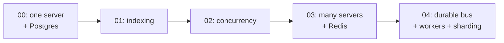

# Real-Time Chat System - From 50 Users to 100k+

A complete, hands-on journey that teaches how to build a real-time chat system the way a real team actually grows one: **start dead simple, then add each piece of technology only when a real problem forces it.**

Every stage is **runnable and verified** (it boots its own database/Redis in Docker and passes a real test), and every stage has a beginner-friendly README explaining *why* it exists and what it improves over the one before.

---

## Two ways to use this repo

1. **Learn by doing** - work through the numbered `stage-*` folders in order. Each is a small program you can run and poke at.
2. **Read the theory** - the `docs/` folder holds the written explanations and the full big-system design.

If you are new, start here: `docs/chat-learning-journey/00-index.md`, then run `stage-00-chat`.

---

## The journey at a glance

Each stage is triggered by a specific problem the previous stage could not handle. That "what breaks next" is the whole point.

| Stage | Handles | The problem it solves | New idea you learn | Folder |
|---|---|---|---|---|
| 00 | ~100 users | (starting point) | One server + Postgres, a clean schema, real WebSocket chat | [`stage-00-chat`](stage-00-chat/) |
| 01 | ~1k users | Queries slow down as data grows | **Indexing** (Seq Scan vs Index Scan), keyset pagination | [`stage-01-indexing-lab`](stage-01-indexing-lab/) |
| 02 | ~1k-10k users | Many users at the *same time* | **Concurrency**: connection pools, timeouts, event loop, load testing | [`stage-02-concurrency-lab`](stage-02-concurrency-lab/) |
| 03 | ~10k-50k users | One server is not enough | **Multiple servers + Redis** routing (the "Alice on A, Bob on B" problem) | [`stage-03-multiserver-redis`](stage-03-multiserver-redis/) |
| 04 | ~50k-100k+ users | Delivery lost if a consumer is down; DB on the hot path | **Durable bus + workers + sharding** (replay, decoupling, partitioning) | [`stage-04-bus-workers-sharding`](stage-04-bus-workers-sharding/) |



---

## The one rule that ties it all together

> **Do not add a technology until a real, measured problem forces it.**

Every box you add (an index, a pool, Redis, a message bus, sharding) is more to run, more to break, and more to learn. A small firm does not start with the giant architecture; it starts with one server and grows. Each stage here shows the exact symptom that justifies the next step, so you build judgment, not cargo-cult complexity.

---

## What is in `docs/`

| Folder | What it is |
|---|---|
| [`docs/chat-learning-journey/`](docs/chat-learning-journey/) | The written version of this journey: one doc per stage (what breaks, why, the fix) plus deep-dive appendices on indexing and concurrency, and a glossary + "when do I add X?" cheatsheet. |
| [`docs/chat-architecture/`](docs/chat-architecture/) | The full principal-architect reference design for 1M users / 100k concurrent / 50k msg/sec: capacity math, diagrams, tech choices with rejected alternatives, data model, delivery semantics, scaling path, failure/security, cost, and real-world challenges. |

The learning journey teaches *how you get there*; the architecture folder is *where it lands* at full scale.

---

## Requirements

- **Node 20+**
- **Docker** (each stage runs its own Postgres, and stages 03-04 also run Redis)

Each stage is fully self-contained: its own `package.json`, its own database on its own port, and its own README. Nothing is shared between stages, so you can run them independently.

## Quick start (Stage 00)

```bash
cd stage-00-chat
cp .env.example .env
npm install
npm run db:up          # Postgres in Docker
npm run dev            # starts the chat server
# in another terminal:
npm run smoke          # end-to-end test: expect ALL SMOKE CHECKS PASSED
```

Then open each later stage's README and follow its own quick start.

## Ports (so nothing clashes)

Each stage uses a distinct host port, so you can even run several at once.

| Stage | Postgres | Redis |
|---|---|---|
| 00 | 5433 | - |
| 01 | 5434 | - |
| 02 | 5435 | - |
| 03 | 5436 | 6380 |
| 04 | 5437 | 6381 |

(The common defaults 5432 / 6379 are deliberately avoided in case your machine already runs a Postgres or Redis.)

---

## How each stage was built (quality bar)

Every stage in this repo was:

- Written in **TypeScript with strict type-checking** (`npm run typecheck` passes).
- Given a **runnable proof** (a smoke test or demo) that was actually executed, with real output captured in its README.
- Booted against **real Postgres/Redis in Docker**, not mocks.
- Left in a **clean state** (containers stopped) so you start fresh.

A couple of real bugs were found and fixed along the way (for example, two servers racing on database migrations in Stage 03, fixed with a Postgres advisory lock). Those lessons are documented in the relevant stage READMEs, because hitting and fixing them is part of learning.

---

## Suggested learning path

1. Read `docs/chat-learning-journey/00-index.md` for the map.
2. Run **Stage 00** and read its README. You now have a working chat.
3. Run **Stage 01** and watch a query go from 68 ms to 0.2 ms when you add an index.
4. Run **Stage 02** and watch what happens to latency when thousands of requests arrive at once.
5. Run **Stage 03** with two servers and see a message hop between them via Redis.
6. Run **Stage 04** and prove that messages survive a worker being offline (replay), then see sharding spread conversations across partitions.
7. Skim `docs/chat-architecture/` to see where the whole thing lands at 1M users.

By the end you will understand not just *how* a scalable chat system is built, but *why* each piece is there, which is the part that actually makes you a better engineer.
