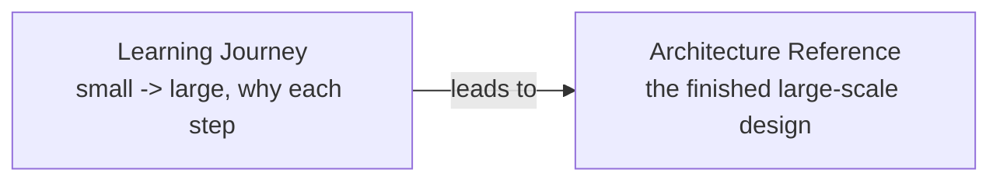

# Real-Time Chat System - Documentation

Two complementary doc sets. Pick based on what you need right now.

## 1. Learning Journey (start here if you are learning)

**`chat-learning-journey/`** - a step-by-step path from a tiny app (50-100 users) up to 100k+. Each stage shows what breaks, why, and why each technology (Postgres, indexing, concurrency, Redis, message bus, sharding) is introduced only when a real problem forces it.

Best for: understanding *how you get there and why*, building a small product that may grow, or learning the concepts hands-on.

Start at [`chat-learning-journey/00-index.md`](chat-learning-journey/00-index.md).

## 2. Architecture Reference (the finished big-system design)

**`chat-architecture/`** - the full principal-architect design for 1M users / 100k concurrent / 50k msg/sec: capacity math, diagrams, tech choices with rejected alternatives, transport, data model, delivery semantics, scaling path, failure/security, cost, and real-world challenges.

Best for: the target design, decision records, and production-grade detail.

Start at [`chat-architecture/00-index.md`](chat-architecture/00-index.md).

## How they relate

The learning journey teaches the reasoning; the architecture reference is where that reasoning lands at full scale. Read the journey first, then use the reference as the blueprint.
