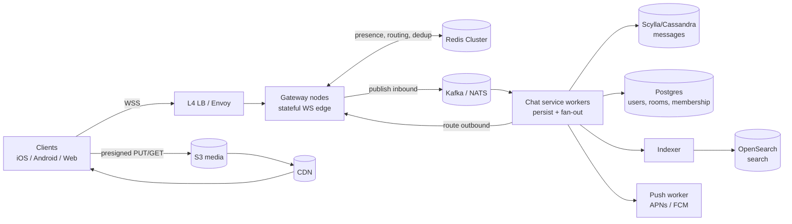
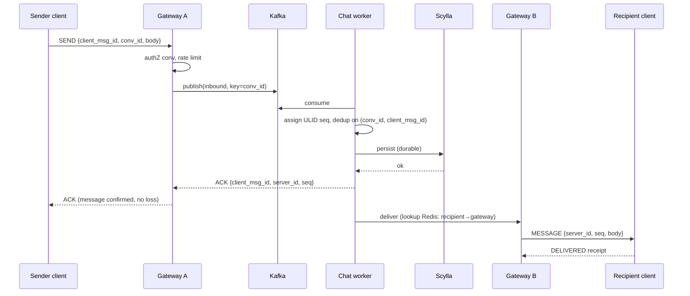
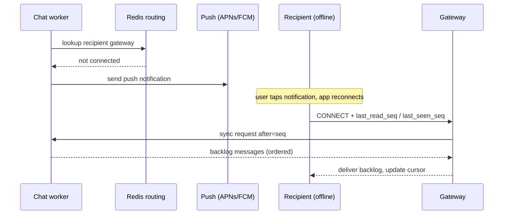

# 02 - Architecture & Diagram

## 2.1 Component overview

| Component | Responsibility | State |
|---|---|---|
| **Client SDK** | WS connection, reconnect, local outbox, cursor sync, dedup | Local outbox + cursor |
| **L4 Load Balancer** | TCP passthrough to gateways, TLS optional passthrough | Stateless |
| **Gateway (WS edge)** | Hold connections, auth handshake, rate limit, backpressure, route in/out | Conn table (in-mem) + Redis routing |
| **Redis Cluster** | Presence, typing, `user → gateway` routing, dedup cache | Ephemeral |
| **Message Bus (Kafka)** | Durable, replayable ingress log; decouples accept/persist/deliver | Durable log |
| **Chat Service (workers)** | Persist, assign server IDs, fan-out, receipts, push triggers | Stateless |
| **Messages DB (Scylla/Cassandra)** | Durable message history, time-ordered per conversation | Durable |
| **Metadata DB (Postgres)** | Users, conversations, memberships, settings | Durable |
| **Search (OpenSearch)** | Async-indexed full-text search | Derived |
| **Object Storage (S3) + CDN** | Media blobs via presigned upload/download | Durable |
| **Push service** | APNs/FCM for offline recipients | Stateless |

## 2.2 High-level diagram

## 2.3 Send path (happy path)

Key point: **the sender ACK happens after durable persist**, so an ACK means "no loss". Delivery to the recipient is a separate asynchronous step; if the recipient is offline, it becomes a push + cursor sync on reconnect.

## 2.4 Receive-while-offline path

## 2.5 Data flow principles

1. **Accept → log → persist → deliver.** The bus (Kafka) is the seam that lets accept and deliver run at different speeds and survive downstream outages.
2. **Routing, not stickiness, moves messages between users on different gateways.** Redis maps `user_id → gateway_node`; the worker (or a peer gateway) publishes to the target node's topic.
3. **Media never touches chat servers.** Clients upload/download directly to S3 via presigned URLs; only the reference (URL + metadata) flows through chat.
4. **Search is derived and async.** Indexing lag is acceptable; it must never block the send path.
5. **Ephemeral vs durable are physically separated.** Presence/typing live only in Redis; messages/receipts are durable.
