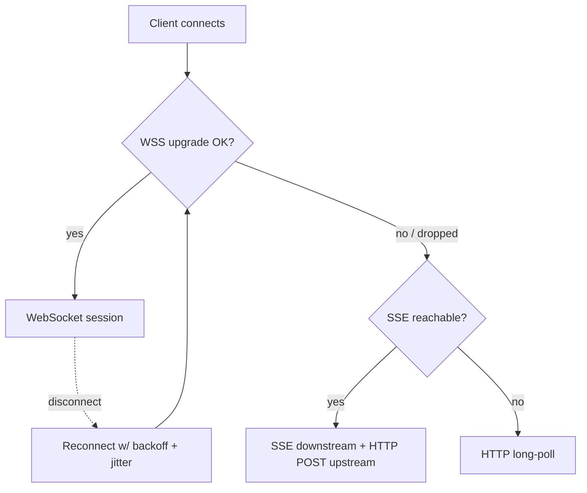
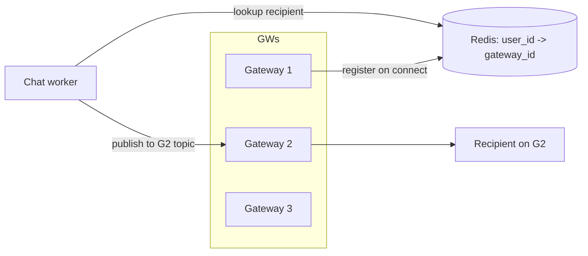

# 04 - Transport & Load Balancing

## 4.1 Transport comparison

| Transport | Direction | Overhead | Mobile/proxy friendliness | Verdict |
|---|---|---|---|---|
| **WebSocket (WSS)** | Full duplex | Low (one upgraded TCP conn, 2-byte frames) | Good; some corporate proxies block | **Primary** |
| **SSE (Server-Sent Events)** | Server→client only | Low, HTTP-native | Good, survives more proxies | **Fallback for downstream** (pair with HTTP POST upstream) |
| **Long-polling** | Half duplex (request/response) | High (10–50× requests, reconnect per message) | Works almost everywhere | **Last resort** |
| **MQTT** | Pub/sub full duplex | Low, QoS levels built-in | Great on lossy/IoT networks | Rejected for web-first MVP (broker + bridge ops) |
| **QUIC / HTTP3** | Full duplex, multiplexed | Low, no TCP head-of-line blocking | Best on lossy mobile | Revisit in scale phase; tooling/LB maturity risk now |

**Decision: WebSocket over TLS as primary, with a documented fallback ladder.**

## 4.2 Fallback strategy

- Try WSS first. On repeated upgrade failure (proxy strips `Upgrade` header), fall to **SSE for server→client** plus **HTTP POST for client→server**. On total failure, **long-poll**.
- All three modes speak the **same message envelope and the same cursor-sync protocol**, so the app layer is transport-agnostic. Only the edge adapter differs.
- Client uses a single reconnect policy: exponential backoff **with jitter** (e.g. base 1s, cap 30s), resume via `after=<last_seq>` cursor.

## 4.3 Heartbeats & liveness

- App-level **ping every 25–30 s** (below common 60 s idle-timeout of LBs/proxies).
- Missing 2 consecutive pongs → server closes and frees the connection; client reconnects.
- Heartbeat doubles as presence keep-alive (refreshes Redis TTL).

## 4.4 Load balancer & sticky sessions

### Do we need sticky sessions?
For WebSocket, a connection stays pinned to one gateway **for its lifetime** by nature (it is one long-lived TCP connection). The real question is how a *new* connection or a reconnect is routed.

- **L4 (TCP) load balancing is preferred.** The LB just forwards the TCP stream; the gateway terminates WS. No cookie-based stickiness required because **cross-user delivery is solved by the routing layer (Redis `user→gateway`), not by co-locating users on the same node.**
- **Avoid L7 sticky cookies as the delivery mechanism.** Stickiness helps keep a reconnecting client on the same node but must never be *required* for correctness. If node X dies, its users must be free to land on any node and resync by cursor.

### Routing between gateways

- On connect, gateway writes `user_id → gateway_id` (with TTL, refreshed by heartbeat) to Redis.
- To deliver, a worker looks up the recipient's gateway and publishes to that node's channel/topic (Redis pub/sub or a per-node Kafka topic). The owning gateway pushes down the socket.
- Multi-device: `user_id` maps to a **set** of `{device_id → gateway_id}`; deliver to all active devices.

### LB implications checklist
- Set LB idle timeout **above** the heartbeat interval (e.g. 120 s) so healthy idle sockets are not killed.
- Enable connection draining on deploy so a node stops taking new conns but lets clients migrate.
- Health checks must reflect **conn capacity**, not just process-up, so full nodes stop receiving new connections.
- TLS: terminate at gateway (or at LB with TCP passthrough) - keep it consistent so WS upgrade headers survive.

## 4.5 Graceful deploys / draining

Rolling a gateway means disconnecting up to ~10–15k users. Mitigation:
1. Drain: stop new conns, broadcast a "reconnect soon" hint.
2. Clients reconnect with jitter (avoid thundering herd) and resume by cursor.
3. Deploy nodes in waves, never all at once.
4. Target < a few seconds of perceived gap per user; no message loss because backlog is replayed from durable storage on resync.
