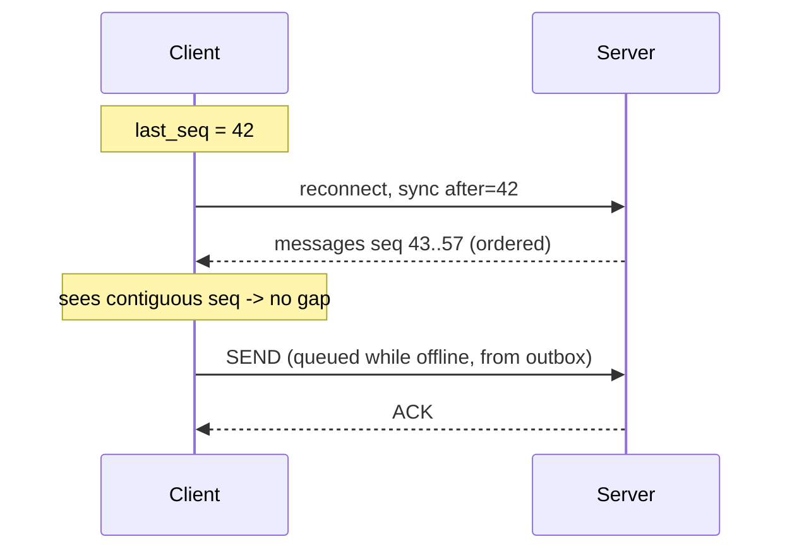
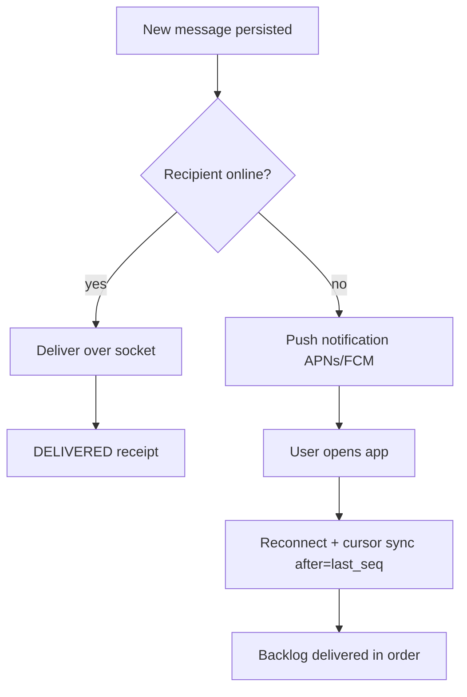

# 06 - Delivery Semantics

The correctness core. Get this right in MVP because it is the most painful thing to change later.

## 6.1 The guarantee we actually provide

**At-least-once delivery + client/server dedup = effectively-once.**

Exactly-once across an unreliable network is a myth. We instead make retries safe (idempotent) and duplicates invisible (dedup), which yields the user-visible behavior of "each message appears once, never lost".

## 6.2 Identifiers

| ID | Who assigns | Purpose |
|---|---|---|
| `client_msg_id` (UUID) | Client | Idempotency key for retries; dedup |
| `message_id` (ULID/Snowflake) | Server | Global, time-sortable, canonical id |
| `seq` | Server, per conversation | Monotonic gap-detection & cursor sync |

## 6.3 Send + ACK flow (no loss)

1. Client generates `client_msg_id`, writes to a **local outbox**, sends.
2. Gateway authorizes, rate-limits, publishes to bus keyed by `conversation_id`.
3. Worker checks dedup on `(conversation_id, client_msg_id)`:
   - **Seen** → return existing `message_id` (idempotent).
   - **New** → assign `message_id` + `seq`, **persist durably**, then record dedup.
4. Worker returns **ACK** `{client_msg_id → message_id, seq}`.
5. Gateway forwards ACK; client removes from outbox.
6. **If no ACK within timeout, client retries with the same `client_msg_id`.** Safe because of dedup.

The ACK means "durably stored" → this is how we honor **no message loss**. Delivery to recipients is a separate async concern.

## 6.4 Ordering

- **Per-conversation ordering only.** Guaranteed by (a) single partition per conversation, (b) time-sortable `message_id`, (c) monotonic `seq` assigned by the worker that owns that conversation's partition/stream.
- **No global ordering.** It is unnecessary for chat and prohibitively expensive (would need a global sequencer). Cross-conversation order is not meaningful to users.
- To keep `seq` monotonic under concurrency, all writes for one conversation flow through the **same bus partition** (key = `conversation_id`), so a single consumer assigns sequence numbers in order.

## 6.5 Dedup (two layers)

- **Server:** unique `(conversation_id, client_msg_id)` + dedup table with TTL. Retries collapse to one row.
- **Client:** track seen `message_id`s / `seq`s; ignore duplicates delivered by at-least-once fan-out or reconnect replay.

## 6.6 Gap detection & cursor sync

Clients detect missed messages via `seq` gaps, not timestamps (clocks lie).

- On reconnect: `GET /messages?conversation=X&after=<last_seq>` (cursor-based, **not** timestamp-based).
- If the client sees a gap (`seq` jumps 43 → 47), it requests the missing range.
- Client flushes its **outbox** (messages composed while offline) on reconnect; dedup makes re-sends safe.

## 6.7 Offline recipients

- Offline user's messages are already durable; nothing is queued in memory waiting.
- A **push notification** nudges the user; on open, the client does cursor sync and pulls the ordered backlog.
- No unbounded server-side per-user queue. The durable message log *is* the queue; the cursor is the pointer.

## 6.8 Fan-out strategy (the scaling crux)

| Group size | Strategy | Why |
|---|---|---|
| 1:1 and small groups (< ~500) | **Fan-out on write**: worker pushes to each online member's gateway; offline members get push + will cursor-sync | Low fan-out, immediate delivery, simple |
| Large/broadcast channels | **Fan-out on read**: write once to the conversation log; clients pull on their own cadence | Avoids N synchronous deliveries per message (the "celebrity/Twitter" problem) |

Because 500 is the cap, MVP uses fan-out-on-write with a bounded parallelism, and reserves fan-out-on-read for any future broadcast/announcement feature. A single 500-member message becomes one persisted write + up-to-500 async deliveries, deduplicated and cursor-recoverable.

## 6.9 Receipts

- **Delivered:** recipient's client acks receipt over socket → update lightweight state.
- **Read:** client advances `last_read_seq`; senders compute "read up to seq" by comparing cursors. No per-message-per-user receipt rows.
- Typing: pure Redis TTL event, throttled client-side, never persisted.

## 6.10 Summary invariants

1. ACK ⇒ durably stored (no loss).
2. Same `client_msg_id` ⇒ same `message_id` (idempotent retries).
3. One conversation ⇒ one ordered `seq` stream.
4. Reconnect ⇒ cursor sync by `seq`, gaps repaired.
5. Offline ⇒ push + pull, never in-memory queue growth.
