# 09 - Cost Estimate & Phased Roadmap

> Costs are order-of-magnitude planning figures for a single cloud region, list-price-ish. Real numbers depend on provider, region, reserved/spot discounts, and actual traffic duty cycle. Treat as a model, not a quote.

## 9.1 MVP cost model (single region, ~100k concurrent capable)

| Component | Sizing | Est. $/mo |
|---|---|---|
| Gateways | ~10 nodes @ 4 vCPU / 8 GB | $1,000–1,800 |
| Chat workers | ~4–6 nodes @ 4 vCPU / 8 GB | $500–900 |
| Message bus (Redis Streams/NATS → Kafka) | 3 brokers @ 4 vCPU / 16 GB | $600–1,200 |
| Messages DB (Postgres→Scylla, 3 nodes) | 3 nodes @ 8 vCPU / 32 GB + fast disk | $1,500–3,000 |
| Metadata Postgres (HA pair) | 1 primary + 1 replica | $400–800 |
| Redis (routing/presence, cluster) | 3 nodes @ 16 GB | $400–800 |
| OpenSearch (search) | 3 nodes (or defer with PG FTS) | $600–1,500 |
| Object storage + CDN (media) | usage-based | $300–1,500 |
| Push (APNs/FCM) | mostly free | ~$0 |
| Load balancer / egress / misc | | $300–800 |
| Observability (metrics/logs/traces) | | $300–1,000 |
| **Total (MVP)** | | **~$6k–13k/mo** |

**Lean MVP** (defer OpenSearch → Postgres FTS, defer Scylla → partitioned Postgres, Redis Streams instead of Kafka): **~$4k–6k/mo**.

### Cost levers (biggest first)
1. **Search index window** - indexing all history forever is a top cost. Bound it.
2. **Storage tiering** - archive cold messages to object storage; don't keep years on premium SSD.
3. **Reserved/committed-use or spot** for steady baseline compute → 30–60% savings.
4. **Media lifecycle** - move rarely-accessed blobs to cheaper storage classes; CDN cache to cut egress.
5. **Presence frugality** - never persist presence/typing; batch presence.

## 9.2 Cost at scale (~1M concurrent, multi-region)
Roughly linear-plus on compute/storage with multi-region multipliers and cross-region egress. Expect **~$60k–150k+/mo** depending on media volume, search retention, and region count. Governed by the same levers above, applied per region.

## 9.3 Phased 8-week roadmap (team of 4)

```mermaid
gantt
  title MVP Roadmap (8 weeks, team of 4)
  dateFormat  X
  axisFormat  W%s
  section Foundations
  Protocol + data model + auth      :a1, 0, 2
  Gateway WS + reconnect/cursor     :a2, 1, 3
  section Core messaging
  Send/ACK + persist + dedup        :b1, 2, 4
  Fan-out + delivery + receipts     :b2, 3, 5
  section Features
  Presence + typing (Redis)         :c1, 4, 5
  Media (S3 presigned) + push       :c2, 4, 6
  History pagination + search       :c3, 5, 7
  section Hardening
  Load test + backpressure + obs    :d1, 6, 8
  Security review + launch prep      :d2, 7, 8
```

### Week-by-week

| Weeks | Focus | Exit criteria |
|---|---|---|
| **1–2** | Protocol (`client_msg_id`, `seq`, cursor sync), data model, JWT auth, single-region skeleton | Two clients exchange a message end-to-end; schema reviewed |
| **2–3** | Gateway: WS + heartbeat + reconnect + routing (Redis) | Reconnect resumes by cursor; multi-node routing works |
| **3–4** | Send/ACK, durable persist, dedup/idempotency | ACK ⇒ persisted; retries dedup; no loss under kill tests |
| **4–5** | Fan-out to online members, receipts, presence, typing | Group (≤500) delivery + read receipts + presence working |
| **5–6** | Media (presigned S3 + CDN), push (APNs/FCM) offline path | Offline user gets push, syncs backlog on open |
| **6–7** | History pagination, search (PG FTS or OpenSearch) | Cursor-paginated history + scoped search |
| **7–8** | Load test to target, backpressure, observability, security review, launch | Meets p99 < 200 ms at target load; runbooks + dashboards ready |

### Team split (4 engineers)
- **E1 - Gateway/transport:** WS edge, reconnect, routing, backpressure, LB.
- **E2 - Messaging core:** send/ACK, dedup, fan-out, ordering, bus.
- **E3 - Data/features:** schemas, history, search, receipts, presence.
- **E4 - Media/push/platform:** S3+CDN, APNs/FCM, observability, CI/CD, load testing.
- Client SDK work shared; the protocol contract (doc 06) is the shared spec everyone builds against.

### Explicitly deferred past MVP
Multi-region, E2EE, advanced moderation/ML, message editing/threads/reactions (unless required), Scylla/Kafka migration (adopt when metrics demand), fancy search relevance.
