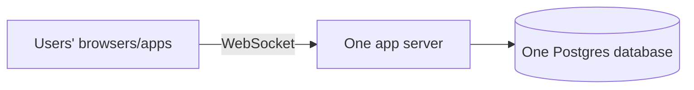

# Stage 00 - 50 to 100 Users: Start Stupid-Simple

**Goal of this stage:** ship a working chat that 50-100 people can use, with the least possible moving parts. Learn the first schema. Resist every urge to "do it properly for scale".

---

## What we build

One single program (a "monolith") that does everything, talking to one database.



That's it. No Redis. No queue. No second server. No microservices.

## Why this is the right call (not laziness)

With 50-100 users:
- All their connections fit in one process's memory easily (100 connections is nothing, a few MB).
- The message rate is tiny (maybe a few messages per second).
- One database on one machine handles this without noticing.

**Adding Redis/queues/sharding here would be pure overhead**: more things to install, monitor, and break, solving problems you do not have. This is the most common beginner mistake: building for a million users while having ten.

## Why Postgres (and not something fancier)?

We pick **Postgres** (a relational SQL database) as the single store because:

1. **It does everything well enough at this size.** Users, messages, group membership, all in one place.
2. **Relationships are natural.** "This message belongs to this conversation, sent by this user" is exactly what relational tables + foreign keys express.
3. **It is safe by default.** Transactions mean a write either fully happens or not at all. You will not half-save a message.
4. **It is boring and proven.** Boring is good. You want your database to be the least exciting thing you own.

We are **not** using a specialized message database (like Cassandra/Scylla) yet, because those trade away convenience (joins, transactions, easy querying) to buy massive write scale that we do not need at 100 users. We will earn our way to that in Stage 04.

## The first schema (kept minimal)

Three tables. In plain English first, then the shape.

- **users**: who can log in.
- **conversations**: a chat room (for 1:1 it is just a room with two people).
- **messages**: the actual chat lines.

```
users
  id            (primary key)
  username      (unique)
  display_name
  created_at

conversations
  id            (primary key)
  type          ('direct' or 'group')
  created_at

conversation_members     -- who is in which conversation
  conversation_id  (-> conversations.id)
  user_id          (-> users.id)
  primary key (conversation_id, user_id)

messages
  id               (primary key)
  conversation_id  (-> conversations.id)
  sender_id        (-> users.id)
  body             (the text)
  created_at
```

**Why a separate `conversation_members` table?** Because a conversation can have many users and a user is in many conversations. That "many-to-many" relationship is exactly what a join table is for. Trying to cram member lists into a single column would hurt you the moment you need to ask "which conversations is Alice in?".

## How a message flows (Stage 00)

1. Alice's app holds a WebSocket to the server.
2. She sends "hi". The server receives it.
3. Server does **one** thing: `INSERT` the message into Postgres.
4. Server looks up who else is in the conversation (Bob), and if Bob is connected, pushes the message down Bob's WebSocket.
5. Done.

No queue, no fan-out workers. The server itself does the whole job because the job is tiny.

## What you are NOT doing yet (on purpose)

| Not doing | Why not yet |
|---|---|
| Redis | 100 users fit in one process; no need to share state between servers |
| Message queue | Message rate is trivial; direct insert is fine |
| Indexes beyond primary keys | Tables are small; full scans are still fast (Stage 01 changes this) |
| Multiple servers | One server has plenty of headroom |
| Read receipts / presence at scale | Add features, but they are cheap at this size |

## Graduation checklist (when to move to Stage 01)

Move on when you notice:
- [ ] Loading a conversation's history feels slow (queries scanning growing tables).
- [ ] You have thousands of messages and "get the last 50 messages" is no longer instant.
- [ ] You start writing `WHERE conversation_id = ...` queries a lot and wonder why they get slower as data grows.

That slowdown is your first real lesson: **indexing**. That is Stage 01.

## One-paragraph summary

At 50-100 users you build one server and one Postgres database, with three simple tables, and you push messages directly. You deliberately avoid Redis, queues, and sharding because they solve problems you do not have yet. The only "advanced" idea here is modeling a many-to-many relationship (users in conversations) with a join table. Ship it, get real users, and let the next real problem tell you what to build next.
