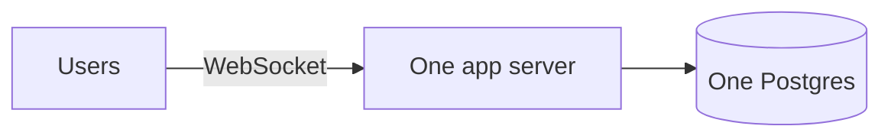
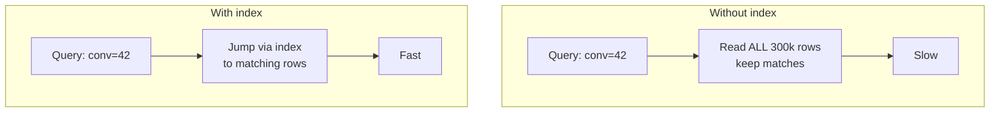

# Stage 01 - 100 to 1,000 Users: The Indexing Lesson

**Goal of this stage:** same architecture as before (one server, one Postgres), but now your data has grown and some queries feel slow. This is where you learn what an **index** is and why it is the single highest-leverage database skill.

---

## What changed

Nothing in the architecture. You still have:



But now you have, say, 500 active users and a few hundred thousand messages. And suddenly:

- Opening a chat takes 1-2 seconds.
- "Load older messages" lags.
- The database CPU is higher than it should be.

## The symptom, concretely

Your app runs this query constantly:

```
SELECT * FROM messages
WHERE conversation_id = 42
ORDER BY created_at DESC
LIMIT 50;
```

At Stage 00 with 2,000 messages this was instant. Now with 300,000 messages it is slow. **Why?**

## Why it got slow: the full table scan

Without help, the database finds "messages where conversation_id = 42" by **reading every single row** and checking each one. That is called a **full table scan** (or sequential scan).

- 2,000 rows to check: instant.
- 300,000 rows to check: slow.
- 30,000,000 rows later: unusable.

It is like finding every page that mentions a word by reading the **entire book** cover to cover, every time.

## The fix: an index

An **index** is a pre-sorted lookup structure the database maintains on the side, so it can jump straight to the rows you want instead of scanning everything.

Analogy: the index at the **back of a textbook**. You want "photosynthesis"? You do not read all 800 pages. You flip to the index, it says "page 214", you go there. That is exactly what a database index does.

```
CREATE INDEX ON messages (conversation_id, created_at DESC);
```

Now "messages for conversation 42, newest first" is a direct jump + a short ordered read, no matter how many total messages exist.

### Before vs after



## What to index (and the mental model)

**Index the columns you filter or sort on frequently**, especially in `WHERE`, `JOIN`, and `ORDER BY`.

| You often run | Index to add |
|---|---|
| `WHERE conversation_id = ? ORDER BY created_at` | `(conversation_id, created_at)` |
| `WHERE username = ?` (login) | `(username)` unique |
| `WHERE user_id = ?` on membership | `(user_id)` |

The `(conversation_id, created_at)` **composite index** matters: it supports both "filter by conversation" and "sort by time" in one structure. Order of columns matters (filter column first, then sort column).

## The cost of indexes (why not index everything?)

Indexes are not free. This is the crucial part most tutorials skip.

1. **Writes get slower.** Every `INSERT`/`UPDATE` must also update every index on that table. More indexes = slower writes.
2. **They use disk/memory.** An index is extra stored data.
3. **Unused indexes are pure waste.** They cost writes and space but help no query.

So the rule is: **index for the queries you actually run, not speculatively.** Add an index when a real query is slow, confirm it helped, and remove indexes nothing uses.

## How to actually diagnose this (real skill)

Postgres tells you what it is doing:

```
EXPLAIN ANALYZE
SELECT * FROM messages WHERE conversation_id = 42 ORDER BY created_at DESC LIMIT 50;
```

- If you see **"Seq Scan"** on a big table for a common query, that is your red flag.
- After adding the index, you should see **"Index Scan"** instead, and a much lower time.

Learning to read `EXPLAIN` is the difference between guessing and knowing.

## Other things that appear at this stage

- **Pagination done right:** instead of `OFFSET 1000 LIMIT 50` (which still scans and skips 1000 rows), use **keyset/cursor pagination**: "give me 50 messages older than the last id I saw". This stays fast forever and is why we designed message ids to be sortable.

```
SELECT * FROM messages
WHERE conversation_id = 42 AND id < :last_seen_id
ORDER BY id DESC LIMIT 50;
```

- **Connection basics:** you start using a small connection pool (more on this in Stage 02).

## Graduation checklist (when to move to Stage 02)

Move on when:
- [ ] Queries are indexed and fast, but the **server itself** struggles when many users act at once.
- [ ] You see requests queueing up even though individual queries are quick.
- [ ] CPU on the app server spikes with concurrent users, or you run out of database connections.

That is no longer a data-shape problem. It is a **concurrency / multi-handling** problem. That is Stage 02.

## Summary

Your architecture did not change; your data grew. Slow queries came from full table scans. You fixed them with **indexes** (a back-of-the-book lookup), learned that indexes speed reads but slow writes so you add them deliberately, and you learned to use `EXPLAIN ANALYZE` to see what the database actually does. You also switched to cursor pagination so history loading stays fast forever.

See [A1 - Indexing explained](A1-indexing-explained.md) for a deeper, standalone treatment.
