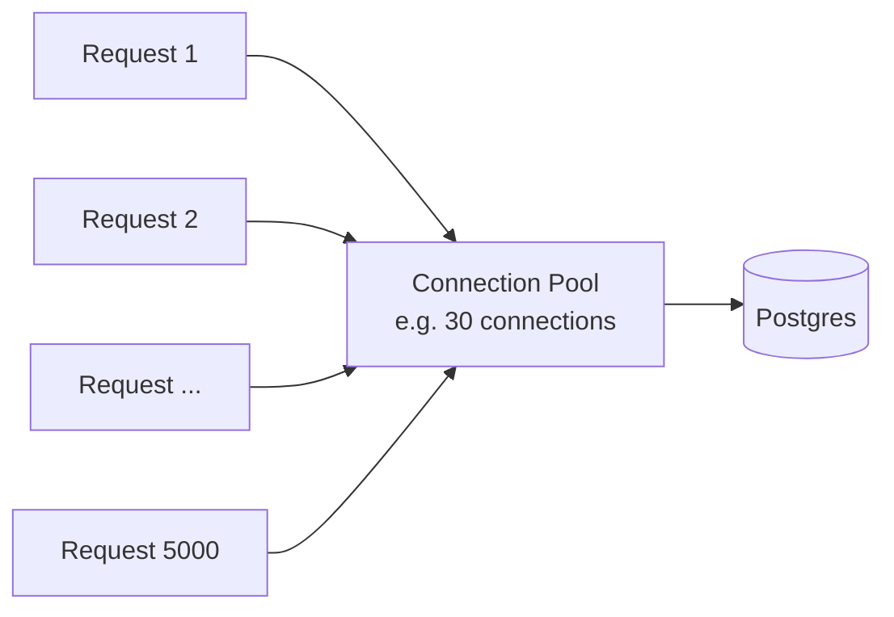

# Stage 02 - 1,000 to 10,000 Users: Concurrency & Multi-Handling

**Goal of this stage:** your queries are fast (Stage 01), but now **many users act at the same time** and the server struggles. This is where you learn how one program serves thousands of people at once, and why "handling many things concurrently" is its own skill.

---

## The new problem in one sentence

It is no longer "the work is slow"; it is "there is a lot of work happening **at the same time**, and my server or database chokes on the simultaneity."

## What "concurrency" actually means here

At any instant you might have 5,000 people connected, and hundreds sending/receiving in the same second. Your one server must:

- Hold thousands of open WebSocket connections at once.
- Read and write to the database for many of them nearly simultaneously.
- Not let one slow operation block everyone else.

Doing many things in overlapping time is **concurrency**. Doing them literally at the same instant on multiple CPU cores is **parallelism**. You need to handle both.

## Symptom 1: "Too many connections" from the database

You suddenly see errors like `FATAL: too many connections` or `connection pool exhausted`.

### Why this happens

Each database connection costs the database real memory and a backend process. Postgres is happiest with a **limited** number of connections (often a few hundred, not thousands). If every user request grabbed its own database connection, 5,000 users would try to open 5,000 connections and Postgres would fall over.

### The fix: a connection pool

A **connection pool** is a small, fixed set of reusable database connections (say 20-50) shared by all requests.

- A request **borrows** a connection, does its quick query, **returns** it.
- Because queries are fast (thanks to indexing), each connection serves many requests per second.
- 30 connections can serve thousands of users, as long as each query is short.

**Lesson:** you do not scale by giving everyone their own connection. You scale by making each connection do quick work and sharing a small pool. This is why Stage 01 (fast queries) had to come first: slow queries hold connections hostage and the pool drains.

Tools: **PgBouncer** (a dedicated pooler) is the classic answer when your app's built-in pool is not enough.

## Symptom 2: One slow operation freezes everyone

If your server handles connections in a naive blocking way, one slow thing (a big query, a slow network client) can stall other users.

### Two common models to handle many connections

| Model | How it handles many users | Examples |
|---|---|---|
| **Event loop (async / non-blocking)** | One thread juggles thousands of connections by never waiting idly; while one waits on the DB, it serves others | Node.js, Python asyncio, Nginx |
| **Lightweight threads / goroutines / processes** | Runtime gives each connection a cheap "thread"; the scheduler multiplexes them across CPU cores | Go (goroutines), Elixir/Erlang (processes), Java virtual threads |

Both aim at the same goal: **never let waiting on one thing block progress on everything else.** For a chat gateway (lots of mostly-idle connections waiting for messages) these models shine, because most connections are just sitting there and cost almost nothing until a message arrives.

**Why chat specifically loves this:** 10,000 connected users might only produce 100 messages/second. You are mostly holding idle sockets. An event loop or lightweight-thread runtime holds tens of thousands of idle sockets cheaply. A model that dedicates a heavy OS thread per connection would waste memory and collapse.

## Symptom 3: Two writes stepping on each other (race conditions)

With many users at once, two operations can interleave badly. Classic example: two people update the same group's member list simultaneously, and one overwrites the other.

### The fix: let the database arbitrate

- **Transactions:** group related writes so they happen all-or-nothing.
- **Atomic operations:** e.g. `UPDATE ... SET count = count + 1` instead of read-then-write in your app.
- **Right-sized locking:** lock the smallest thing for the shortest time. Do not lock a whole table when you mean one row.

Postgres gives you these tools; the skill is using the narrowest one that is still correct.

## Symptom 4: The "assign a sequence number" ordering need

As traffic rises you want each message in a conversation to get a clean increasing number (for ordering and gap detection). Under concurrency, two messages arriving at once must not get the same number. You solve this by making a **single place** responsible for numbering each conversation's messages (one writer per conversation), which is a preview of how we route work in Stage 03.

## What you tune at this stage

| Lever | What it does |
|---|---|
| Connection pool size | Match DB capacity; too big overwhelms Postgres, too small starves the app |
| PgBouncer | Multiplexes many app connections onto few DB connections |
| Async / concurrency model | Keeps one slow op from blocking others |
| Read replicas (maybe) | Send read-heavy queries (history, search) to a copy of the DB to spare the primary |
| Caching hot data | Keep frequently-read, rarely-changed data (user profiles) in memory |

## What you still do NOT need yet

- You are still on **one app server** (or maybe two behind a basic load balancer). Vertical growth (a bigger box) plus concurrency tuning gets you surprisingly far.
- No message queue, no Redis pub/sub yet, no sharding.

## Graduation checklist (when to move to Stage 03)

Move on when:
- [ ] One server is at its limit: CPU/memory maxed, or it simply cannot hold more connections.
- [ ] You need a second (third, fourth) server for capacity or redundancy, and now realize: **if Alice is connected to server A and Bob to server B, how does Alice's message reach Bob?**
- [ ] A single server restart/crash drops everyone, and you cannot afford that.

That cross-server delivery question is the whole reason Stage 03 introduces Redis and routing.

## Summary

Fast queries were not enough; the challenge became **simultaneity**. You learned to share a small **connection pool** instead of one-connection-per-user, to use an **event-loop or lightweight-thread** model so idle sockets are cheap and no single slow operation blocks others, and to lean on the **database (transactions, atomic updates, narrow locks)** to prevent race conditions. You are still essentially one server, but now you understand how a single server can juggle thousands of users. The next wall is needing more than one server.

See [A2 - Concurrency & multi-handling](A2-concurrency-multihandling.md) for the standalone deep-dive.
