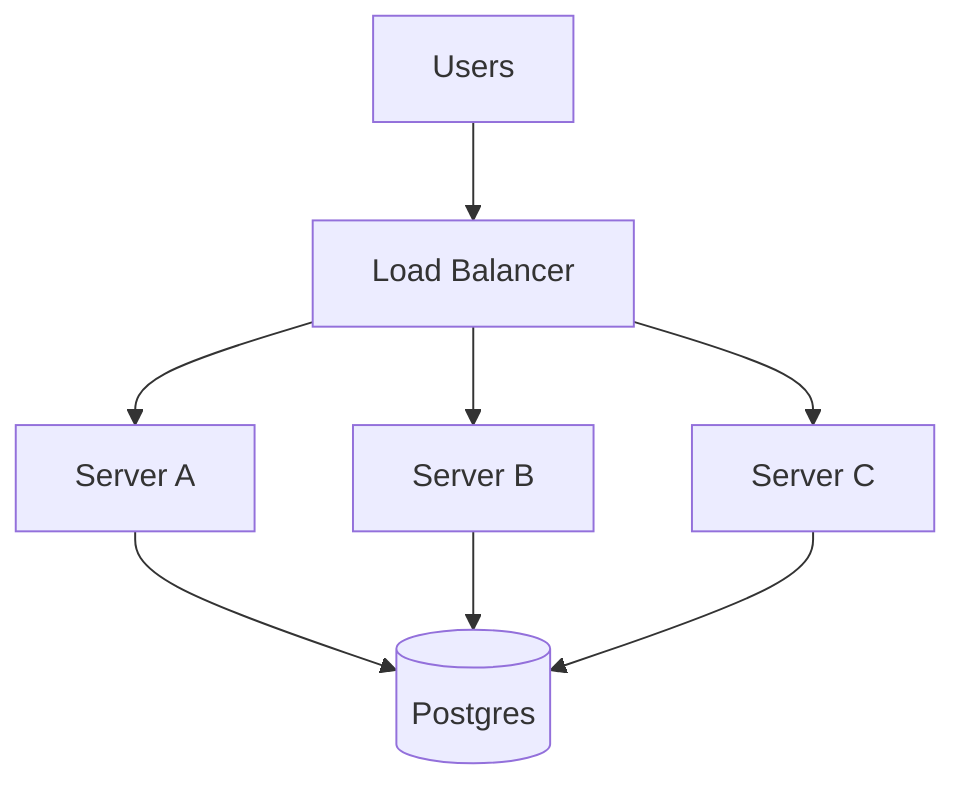
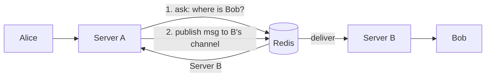

# Stage 03 - 10,000 to 50,000 Users: Many Servers & Redis

**Goal of this stage:** one server is no longer enough. You add more servers, and immediately hit a new problem unique to real-time systems: **users on different servers need to talk to each other.** This is why Redis enters your life.

---

## The wall you hit

At Stage 02 you tuned one server to its limit. Now:
- One machine cannot hold 30,000+ WebSocket connections, or its CPU is maxed.
- A single server is a single point of failure: it restarts, and everyone drops.

So you run several servers behind a **load balancer** that spreads new connections across them.

## The new problem: Alice and Bob are on different servers

- Alice's WebSocket is held by **Server A**.
- Bob's WebSocket is held by **Server B**.
- Alice sends a message for Bob. Server A has Bob's message, but **Server A has no connection to Bob**. Only Server B does.

At Stage 00-02 this never happened because there was one server holding everyone. Now the servers are islands.

## Fix part 1: a shared "who is where" directory (Redis)

You need a fast, shared place that all servers can read/write to answer "**which server is Bob connected to right now?**"

That is **Redis**: an in-memory key-value store, extremely fast, shared by all your servers.

- When Bob connects to Server B, Server B writes to Redis: `user:bob -> server_B`.
- When Server A needs to deliver to Bob, it asks Redis: "where is Bob?" Redis says "Server B".

**Why Redis and not Postgres for this?** Because this lookup happens constantly and must be sub-millisecond, and the data is throwaway (it changes every time someone connects/disconnects). Redis lives in memory and is built for exactly this hot, ephemeral, high-frequency access. Putting it in Postgres would hammer your main database with pointless churn.

## Fix part 2: servers passing messages to each other (Redis pub/sub)

Knowing Bob is on Server B is not enough; Server A must actually **hand the message to Server B**. You use **publish/subscribe (pub/sub)**:

- Each server subscribes to a channel for the messages it must deliver.
- Server A **publishes** "message for Bob" to Server B's channel.
- Server B receives it and pushes it down Bob's WebSocket.

Redis now plays **two roles**: the presence/routing directory, and the messenger between servers.

## Other jobs Redis naturally takes over here

Because Redis is fast, shared, and expiring, it is the perfect home for all the **ephemeral** data that you should never burden Postgres with:

| Data | Why Redis |
|---|---|
| Presence (online/offline) | Changes constantly, ok if slightly stale, expires on disconnect |
| Typing indicators | High frequency, worthless if lost, must vanish quickly (TTL) |
| "User -> server" routing | Hot lookup on every cross-server delivery |
| Rate-limit counters | Fast increment-and-check |

**Rule that emerges:** durable, must-never-lose data (messages, users) lives in **Postgres**; fast, ephemeral, ok-to-lose data lives in **Redis**. Keeping them separate is a core scaling instinct.

## The sticky-session question (and why we avoid depending on it)

Some teams make the load balancer "sticky" so a user always returns to the same server. That helps reconnects, but you must **not depend on it for correctness**: if Server A dies, its users must be free to reconnect to any server and resume. That is why delivery is solved by the Redis routing/pub-sub layer, not by forcing users onto one box.

## What breaks about naive Redis pub/sub (a preview of Stage 04)

Basic Redis pub/sub broadcasts to whoever is listening and does **not remember** messages. If a server was momentarily down, it misses what was published. That is fine for typing indicators, but for real messages you rely on the fact that the message is **already saved in Postgres** first, so nothing is truly lost, a disconnected user just re-reads from the database on reconnect.

As volume keeps climbing, you will want a system that also **stores and replays** the stream reliably. That is the message queue/bus in Stage 04.

## New failure modes you must now handle

| Failure | What happens | Mitigation |
|---|---|---|
| A server crashes | Its users drop | They reconnect (with backoff + jitter) to another server, re-sync missed messages from Postgres |
| Deploy/restart | Same as crash for that server | Roll servers one at a time (drain), never all at once |
| Reconnect storm | Thousands reconnect at once | Backoff **with jitter** so they do not all retry the same millisecond |
| Redis down | Routing/presence break | Run Redis with a replica; messages still safe in Postgres; degrade gracefully |

## Graduation checklist (when to move to Stage 04)

Move on when:
- [ ] Message volume is high enough that writing every message straight to Postgres on the hot path is becoming the bottleneck.
- [ ] Redis pub/sub fan-out (especially large groups) is straining, and you need reliable, replayable delivery, not fire-and-forget.
- [ ] Postgres, even tuned and indexed, is hitting its write ceiling for the message table specifically.

Those are the signals to introduce a **message queue/bus** and a **write-optimized database with sharding**. That is Stage 04.

## Summary

One server could not hold everyone, so you ran several behind a load balancer, and instantly faced the "users on different servers" problem. **Redis** solved it twice: as the shared **directory** of who is connected where, and as the **pub/sub messenger** passing messages between servers. Redis also absorbed all the ephemeral, high-churn data (presence, typing, rate limits) that should never touch Postgres. The durable-vs-ephemeral split (Postgres vs Redis) is the big idea of this stage. You also learned that delivery must not depend on sticky sessions, and that saving to Postgres first is what keeps messages safe even when pub/sub misses.
