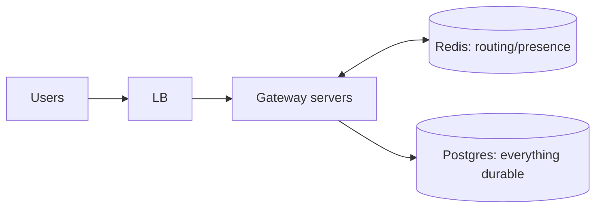
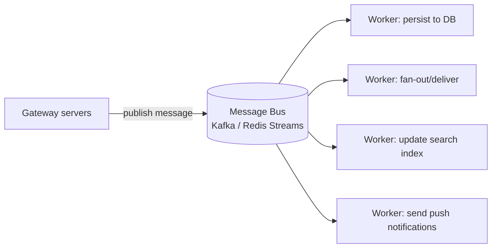
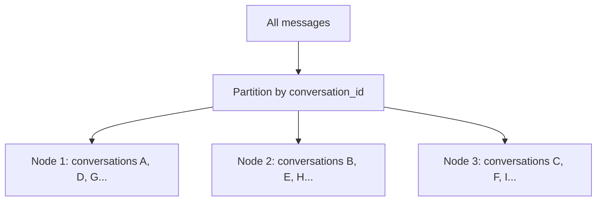
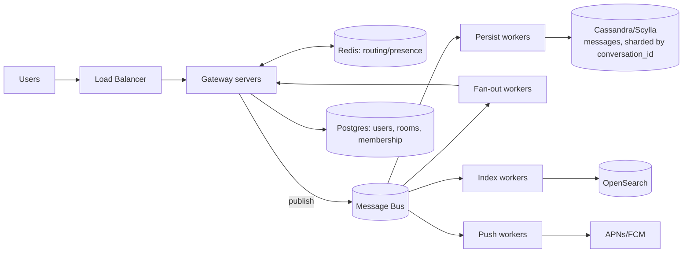

# Stage 04 - 50,000 to 100,000+ Users: Queue, Wide-Column DB & Sharding

**Goal of this stage:** you are now genuinely at scale. The last simplifications break: writing every message straight to Postgres on the hot path is too much, and one database machine cannot hold or write all the data. You learn three big ideas: a **message queue/bus**, a **write-optimized (wide-column) database**, and **sharding/partitioning**.

---

## Where Stage 03 left off

Many servers, Redis for routing/presence, Postgres for durable data.

The two things now breaking:
1. **The hot path does too much.** For every message, a gateway must save it, look up recipients, and deliver, all while holding thousands of sockets. At 50k msg/sec this couples "accept" and "persist" and "deliver" too tightly, one slow step backs up everything.
2. **One Postgres cannot keep up with message writes,** even indexed and tuned.

## Big idea 1: put a queue/bus in the middle

Instead of the gateway doing everything inline, it just drops the incoming message onto a **durable log (a message bus)** and moves on. Separate **worker** processes read from the bus and do the heavy work (persist, fan-out, indexing, push notifications).

**Why this helps (in plain terms):**
- **Decoupling:** the gateway accepts messages fast and never blocks on slow downstream work. Accepting and processing run at their own speeds.
- **Absorbing spikes:** if a burst arrives, it queues up and workers catch up, instead of overwhelming the database. The queue is a shock absorber.
- **Durability & replay:** a good bus (Kafka) **stores** the stream, so if a worker crashes, it resumes where it left off. Nothing is lost. This fixes the "naive pub/sub forgets" weakness from Stage 03.
- **Independent scaling:** need faster persistence? Add persist-workers. Need faster search indexing? Add index-workers. You scale each job separately.

**Why not from day one?** A bus (especially Kafka) is real operational weight: partitions, retention, consumer groups. At 100 users it is pure overhead. You add it now because the decoupling and durability finally pay for that complexity.

## Big idea 2: a write-optimized database for messages (wide-column)

Postgres is a fantastic general database, but the **messages** table has a brutal profile: enormous write rate, append-mostly, always read as "the recent messages of one conversation, in order". Past roughly 10k-20k writes/sec on one machine, a single Postgres primary strains.

You move **messages** (not everything) to a **wide-column database** like **Cassandra or ScyllaDB**, which is built for exactly this: massive write throughput spread across many machines, and fast ordered reads within a partition.

| Keep in Postgres | Move to Cassandra/Scylla |
|---|---|
| Users, auth | Messages (the firehose) |
| Conversations, membership, settings | (optionally) read receipts/cursors |
| Relational, moderate-volume, needs joins/transactions | Append-heavy, time-ordered, huge volume |

**What you trade away:** wide-column stores give up easy joins, some transaction guarantees, and flexible ad-hoc queries. You accept that trade **only for the messages table**, because there the write scale is worth it and you already know the one query shape you need ("recent messages of a conversation, ordered").

## Big idea 3: sharding / partitioning (spreading data across machines)

One machine can only hold and write so much. **Sharding** (a.k.a. partitioning) splits your data across many machines by a **shard key**, so each machine owns a slice.

The critical decision is **what to shard by**. For chat messages, the shard/partition key is **`conversation_id`**.

**Why `conversation_id` is the right shard key:**
- All messages of one conversation land on the **same node**, so "get the last 50 messages of conversation 42, in order" is a fast single-node ordered read. That is the query you run constantly.
- It spreads load evenly across many conversations.

**Why not shard by `user_id`?** Because a conversation has two+ users; sharding by user would scatter one conversation's messages across nodes, and reading it in order would require gathering from many machines. Ordering and pagination would become painful. **The shard key must match how you read the data.** That is the whole lesson of sharding.

### The hot-partition gotcha
One giant, hyperactive group can make its partition a hotspot. Mitigation: cap group size, and for extreme cases extend the key to `(conversation_id, month)` so a huge conversation is split into time buckets. This is an advanced tweak you apply only where measurements show a hotspot.

## Big idea 4: search needs its own home

"Search all my messages for the word 'invoice'" is a terrible query for both Postgres-at-scale and Cassandra (neither is built for full-text search over huge data). So a **search engine** (OpenSearch/Elasticsearch) subscribes to the bus and builds an **inverted index** (word -> messages containing it). Search hits the search engine, not your message store, and it never blocks sending.

## Putting the whole Stage 04 picture together

## Fan-out at this scale (small vs large groups)

- **Small conversations/1:1:** deliver to each online member directly (fan-out on write). Cheap.
- **Very large/broadcast rooms:** do not synchronously push to everyone; write once and let clients pull (fan-out on read). This avoids one message becoming thousands of instant deliveries.

## What you learned across the whole journey

| Stage | Trigger (what broke) | What you added | Why |
|---|---|---|---|
| 00 | Nothing (starting) | One server + Postgres | Simplicity beats premature scale |
| 01 | Slow queries as data grew | **Indexes** + cursor pagination | Avoid full table scans |
| 02 | Many users at once | **Connection pool** + async/concurrency | Serve simultaneity without exhausting the DB |
| 03 | One server not enough | More servers + **Redis** routing/pub-sub | Cross-server delivery; ephemeral data off Postgres |
| 04 | Firehose writes & one-DB limit | **Bus** + **wide-column DB** + **sharding** + search engine | Decouple, absorb spikes, scale writes across machines |

## The meta-lesson

Every single addition was **forced by a specific, observed problem**, not chosen upfront. That is how real systems grow. A small firm starts at Stage 00 and only climbs when metrics prove the current stage is hurting. If you learn to recognize the **symptom** at each stage, you will always know what to build next, and just as importantly, what **not** to build yet.

## Where to go deeper

- Indexing internals: [A1](A1-indexing-explained.md)
- Concurrency internals: [A2](A2-concurrency-multihandling.md)
- Every term + a "when do I add X?" table: [A3](A3-glossary-cheatsheet.md)
- The full big-system reference design: `../chat-architecture/`
