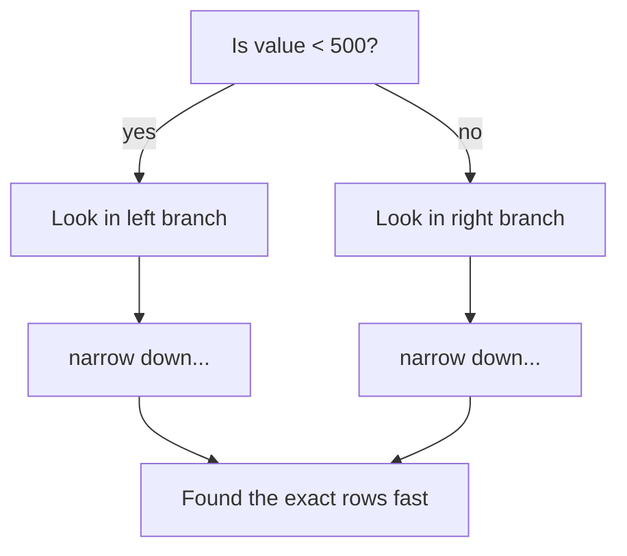
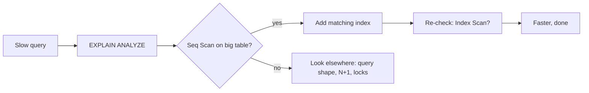

# Appendix A1 - Indexing Explained (Standalone)

A deeper, self-contained explanation of database indexes. If Stage 01 made you curious, this is the full story in plain language.

---

## 1. The core idea

A database table is like a big pile of rows. When you ask "find all rows where `conversation_id = 42`", the database has two choices:

1. **Read the entire pile** and keep the matches. (Slow when the pile is huge.)
2. **Consult an index** that already knows where `conversation_id = 42` rows are, and jump straight to them. (Fast.)

An **index** is a separate, sorted data structure the database maintains automatically so option 2 is possible.

## 2. The textbook analogy (the one that sticks)

Imagine an 800-page textbook and you want every mention of "mitochondria".

- **No index:** read all 800 pages. Every time. That is a **full table scan** / **sequential scan**.
- **With the back-of-book index:** flip to "mitochondria -> pages 210, 355, 700". Jump directly. That is an **index scan**.

The database index is literally the same concept: a sorted list of values pointing to where the matching rows live.

## 3. How it works under the hood (just enough)

Most databases use a structure called a **B-tree** for indexes. Picture a tree you navigate by comparisons:

Each step throws away half (or more) of the remaining possibilities. So finding a value among a million rows takes only a handful of hops instead of a million checks. This is why an index turns "scan millions" into "a few jumps".

## 4. When an index helps

Indexes help queries that **filter or sort** on the indexed column(s):

| Query pattern | Helped by index on |
|---|---|
| `WHERE username = 'alice'` | `(username)` |
| `WHERE conversation_id = 42 ORDER BY created_at DESC` | `(conversation_id, created_at)` |
| `JOIN ... ON m.conversation_id = c.id` | `(conversation_id)` |
| `WHERE created_at > '2024-01-01'` | `(created_at)` |

## 5. Composite (multi-column) indexes and column order

An index on `(conversation_id, created_at)` is like a phone book sorted first by last name, then by first name.

- Great for "all messages of conversation 42, sorted by time" (uses both columns).
- Great for "all messages of conversation 42" (uses just the first column).
- **Not** helpful for "all messages at a certain time across all conversations" (the first column, conversation_id, is not in your filter). Just like a phone book sorted by last name does not help you find everyone with first name "John".

**Rule:** put the column you filter by **exactly** (equality) first, and the column you sort/range by second.

## 6. The cost side (why not index every column?)

Every index is a promise the database must keep up to date. Costs:

1. **Slower writes.** Insert a message -> the database must also insert into every index on that table. Ten indexes = ten extra updates per write.
2. **Disk and memory.** Indexes are stored data; big indexes eat space and cache.
3. **Maintenance.** More indexes = more for the query planner to consider and for you to reason about.

Because chat is **write-heavy**, over-indexing the messages table directly slows the thing you do most (writing messages). So you index **exactly the queries you run**, no more.

## 7. How to know if you need one (the practical loop)

1. Find a slow query (from logs, or user complaints).
2. Run `EXPLAIN ANALYZE <the query>`.
3. See **"Seq Scan"** on a large table for a frequent query? That is the smell.
4. Add the index that matches the `WHERE` + `ORDER BY`.
5. Run `EXPLAIN ANALYZE` again. You want to see **"Index Scan"** and a much lower time.
6. Periodically check for **unused indexes** and drop them (Postgres tracks index usage stats).

## 8. Special index types you will meet

| Type | For |
|---|---|
| **B-tree** (default) | Equality and range: `=`, `<`, `>`, `ORDER BY` |
| **Unique** | Enforce no duplicates (e.g. `username`), and speed lookups |
| **Composite** | Multi-column filters/sorts (e.g. `(conversation_id, created_at)`) |
| **Full-text (GIN)** | Searching words inside text (Postgres FTS) |
| **Partial** | Index only some rows (e.g. only `WHERE deleted = false`) to stay small |

## 9. The "index vs specialized store" boundary

At some point (Stage 04) full-text search over huge data outgrows even Postgres full-text indexes, and you move search to a dedicated engine (OpenSearch) whose entire job is an **inverted index** (word -> documents). That is just "indexing" taken to its specialized extreme. The mental model never changed: precompute a fast lookup so you do not scan everything.

## 10. One-paragraph takeaway

An index is a precomputed, sorted shortcut (like a book's back-index) that lets the database jump to matching rows instead of scanning the whole table. It makes reads fast but makes writes a bit slower and uses space, so you add indexes deliberately for the queries you actually run, verify with `EXPLAIN ANALYZE`, and remove ones nobody uses. It is the highest-leverage, lowest-effort database skill you can learn.
