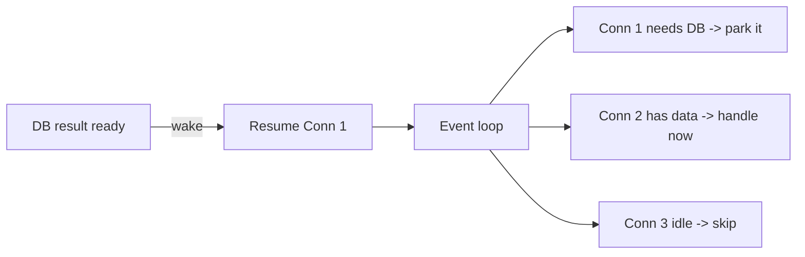
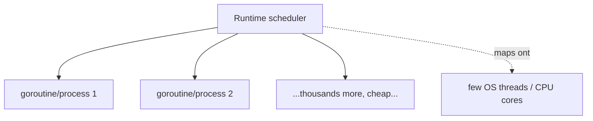
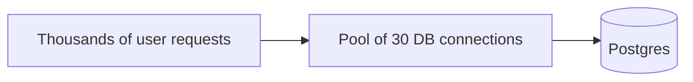
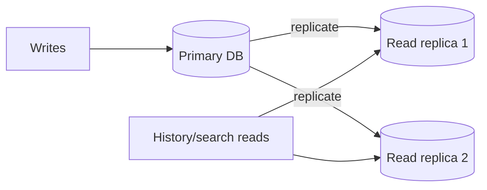

# Appendix A2 - Concurrency & Multi-Handling (Standalone)

How does one program serve thousands of people "at the same time"? This is the full, plain-language story behind Stage 02.

---

## 1. Concurrency vs parallelism (the two words people mix up)

- **Concurrency:** dealing with many things in overlapping time by switching between them quickly. One cook juggling four dishes, stirring one while another simmers.
- **Parallelism:** doing many things at literally the same instant using multiple workers. Four cooks, four dishes, at once (needs multiple CPU cores).

A busy chat server needs both: juggle thousands of connections (concurrency) and use all CPU cores (parallelism).

## 2. Why chat is a special (easy, in one way) case

A chat server holds tons of connections that are **mostly idle**, just waiting for the next message. 10,000 people connected might send only ~100 messages/second total. So the challenge is not "do 10,000 things at once", it is "**hold 10,000 mostly-sleeping connections cheaply** and wake up instantly when one has activity."

This shapes every choice below.

## 3. The blocking problem (what we must avoid)

Naive approach: dedicate one heavy OS thread to each connection, and when that connection waits for the database, the thread just **sits there blocked**, doing nothing but consuming memory.

- 10,000 connections -> 10,000 heavy threads -> gigabytes wasted, scheduler thrashing.
- One slow database call blocks that whole thread.

We need a way to **not waste a whole worker while waiting.**

## 4. Two models that solve it

### Model A: the event loop (async / non-blocking)

One (or a few) threads run a loop. When a connection needs to wait (for the DB, network, disk), the code says "wake me when it is ready" and the loop **moves on to serve other connections** meanwhile. Nothing sits idle-blocked.

- **Used by:** Node.js, Python asyncio, Nginx, Netty.
- **Strength:** enormous numbers of idle connections, tiny memory each.
- **Watch out:** never do heavy CPU work directly in the loop; it blocks everyone. Offload CPU-heavy tasks.

### Model B: lightweight threads (green threads / goroutines / processes)

The runtime gives each connection its own **very cheap** thread-like thing (not a heavy OS thread) and a smart scheduler multiplexes thousands of them onto a few real CPU cores. When one "waits", the scheduler runs another.

- **Used by:** Go (goroutines), Elixir/Erlang (processes), Java virtual threads.
- **Strength:** you write simple "one thread per connection" style code, but it scales because the threads are cheap and the scheduler handles waiting.
- **Elixir/Erlang** is especially loved for chat: millions of tiny isolated processes, built for exactly this.

Both models reach the same goal: **waiting on one thing never wastes the ability to serve others.**

## 5. The database connection bottleneck (and pooling)

Your app can juggle 10,000 connections, but your **database cannot** accept 10,000 direct connections; each one costs it real memory and a backend process. Postgres is happiest with dozens to a few hundred.

### Connection pool

A **pool** is a small set of reusable DB connections (say 30) shared by all requests.

- A request **borrows** a connection, runs a **fast** query, **returns** it.
- Because queries are fast (you indexed them in Stage 01!), 30 connections churn through thousands of requests per second.
- **This is why fast queries matter for concurrency:** a slow query holds a pooled connection hostage, the pool drains, and new requests wait. Indexing and concurrency are linked.

Tool: **PgBouncer** sits in front of Postgres and multiplexes many app-side connections onto few real DB connections.

## 6. Race conditions (when concurrency corrupts data)

When two operations run concurrently on the same data, they can interleave badly.

**Example:** a counter "unread = 5". Two increments happen at once. Both read 5, both write 6. You lost an increment; it should be 7.

### Fixes, smallest tool first

| Tool | Use when |
|---|---|
| **Atomic operation** (`UPDATE SET n = n + 1`) | Simple in-place change; let the DB do it in one step |
| **Transaction** | Several writes must all succeed or all fail together |
| **Row lock** (`SELECT ... FOR UPDATE`) | You must read-then-write one row safely |
| **Single-writer design** | Route all changes to one thing (e.g. one worker owns each conversation's numbering) so there is no contention at all |

The skill is picking the **narrowest** tool that is still correct. Locking a whole table when you meant one row kills concurrency.

## 7. Backpressure (protecting yourself from overload)

If work arrives faster than you can handle it, buffers grow until you run out of memory and crash. **Backpressure** means: when you are overwhelmed, push back instead of silently piling up.

In chat: each connection has a **bounded** outgoing message queue. If a client is too slow to receive and its queue fills, you drop that one connection rather than let it balloon memory and take down everyone. Protect the many from the one.

## 8. Read replicas (spreading read load)

Reads (loading history, search) often vastly outnumber writes. You can keep **copies (replicas)** of the database that serve read-only queries, sparing the primary for writes.

Caveat: replicas can lag slightly behind the primary, so do not use them for "read your own just-written data" cases.

## 9. Putting it together: the concurrency toolkit

| Problem | Tool |
|---|---|
| Hold many idle connections cheaply | Event loop or lightweight threads |
| DB can't take thousands of connections | Connection pool / PgBouncer |
| Slow query drains the pool | Indexing (fast queries) |
| Two writes corrupt data | Atomic ops / transactions / narrow locks |
| Overload eats memory | Backpressure + bounded queues |
| Too many reads on primary | Read replicas |
| Use all CPU cores | Multiple worker processes / parallel runtime |

## 10. One-paragraph takeaway

Serving thousands of users at once is about **never wasting a worker while it waits**. You do that with an event-loop or lightweight-thread model that holds idle connections cheaply. Because your database cannot take thousands of direct connections, you share a small **connection pool**, which only works if your queries are fast (hence indexing). You defend data with atomic operations, transactions, and narrow locks, and you defend memory with backpressure. Get these right and one well-tuned server carries far more than beginners expect, which is exactly why you delay adding more servers until Stage 03.
