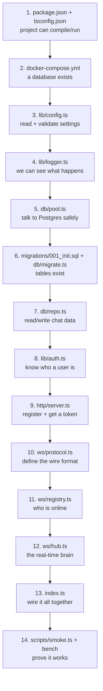

# Stage 00 Chat: How We Built It (the order we made files, and why)

The other two docs explain the *idea* and the *finished code*. This one tells
the **story of construction**: what we made first, what we made next, why we
split things into many files instead of one big file, and which npm packages
mattered and why we chose each. Read this if you want to feel the flow of
"starting from scratch."

The golden rule we followed the whole way:

> **Build the skeleton before the muscles. Make it *runnable* at every step,
> then add the next layer.** Never write 10 files and hope they work together.

---

## The order at a glance



Notice the shape: **foundation -> data -> identity -> HTTP -> real-time -> wiring
-> proof.** Each step only needs the steps before it. That is not an accident,
it is how we decided the order.

---

## Step 0: Why not just one big `index.ts` file?

A beginner's first instinct is to put everything in one file. For a 20-line toy
that is fine. We chose many small files on purpose, for reasons that pay off
immediately, not "someday":

1. **One file = one job (single responsibility).** When a query is slow, you go
   to `repo.ts`. When auth is wrong, you go to `auth.ts`. You never scroll
   through 800 lines hunting for the 5 that matter.
2. **You can build and test in layers.** We got the database working before the
   WebSocket even existed. Impossible if it is all tangled in one file.
3. **You isolate the things that will change.** The whole point of Stage 00 is
   that it grows into later stages. We put the "one server only" assumption in
   *one* file (`registry.ts`) so the Stage 03 upgrade touches one file, not
   everything.
4. **Imports become a dependency map.** Because each file imports what it needs,
   the `import` lines literally draw the architecture: `hub.ts` imports
   `repo.ts` and `auth.ts`, so you know the real-time layer sits on top of the
   data and identity layers.

The cost of splitting is a few extra `import` lines. The benefit is a codebase
you can reason about. Cheap trade.

---

## Step 1: `package.json` + `tsconfig.json` - make the project real

**Why first?** Nothing runs without this. Before any logic, we need Node to know
what this project is, which packages it uses, and how to run TypeScript.

**Key choices in `package.json`:**
- `"type": "module"` - we use modern ES modules (`import`/`export`), not the old
  `require`. This is why every local import ends in `.js` even though the files
  are `.ts` (that is how Node ESM resolves compiled output).
- `"engines": { "node": ">=20" }` - we rely on Node 20 features (like the
  built-in `fetch` used in the smoke test), so we state it.
- The `scripts` block is our control panel: `dev`, `db:up`, `db:migrate`,
  `seed`, `smoke`. We wrote these as we needed them, but they live here from the
  start.

**Why these packages (and why not more):** we kept dependencies tiny. Each one
earns its place.

| Package | Why we needed it | What we avoided by using it |
|---|---|---|
| `ws` | The WebSocket server. It is the standard, minimal, battle-tested choice. | Writing raw HTTP-upgrade handshake code ourselves. |
| `pg` | The Postgres driver + connection pool. | Hand-rolling a TCP protocol client and pooling. |
| `zod` | Validate all input (env, HTTP bodies, WS messages) with real TypeScript types. | Writing manual `if (typeof x !== 'string')` checks everywhere. |
| `pino` | Fast structured JSON logging. | `console.log` strings that we could never search at scale. |
| `ulid` | Time-sortable unique ids generated in the app. | A DB auto-increment counter that becomes a bottleneck when we shard. |
| `dotenv` | Load a local `.env` file into `process.env`. | Hardcoding secrets or exporting env vars by hand every time. |

Notice what is **not** here: no Express, no ORM, no Redis client, no framework.
We used Node's built-in `http` module instead of Express because our HTTP
surface is three routes. Adding a framework would be weight we do not need yet.

**`tsconfig.json`** turns on strict safety: `strict`, `noUncheckedIndexedAccess`
(array access might be undefined, so the compiler forces you to check),
`noFallthroughCasesInSwitch`, `exactOptionalPropertyTypes`. We chose these so the
compiler catches whole classes of bugs before the code ever runs. Strictness is
cheapest to adopt on day one.

---

## Step 2: `docker-compose.yml` - give ourselves a database

**Why here?** Our whole app talks to Postgres. Before writing DB code, we need a
Postgres to talk to, reproducibly, on any machine. Docker gives everyone the
exact same Postgres 16 with one command (`npm run db:up`).

We mapped host port **5433** (not 5432) so it does not clash with a Postgres you
might already have. We added a `healthcheck` so tooling can tell when the DB is
actually ready, not just started.

---

## Step 3: `src/lib/config.ts` - read settings, and refuse to start if they are wrong

**Why this is the first *code* file?** Every other file needs settings: the DB
url, the port, the auth secret. So config is the true root of the dependency
tree. Almost everything imports it.

**Why the "validate and exit" method?** We used `zod` to describe every setting
and its rules (`AUTH_SECRET` at least 8 chars, `PORT` a positive int). If the
environment is bad, we print exactly what is wrong and `process.exit(1)`. We
chose *fail fast at boot* over *crash mysteriously later*, because a clear error
at startup is a thousand times cheaper to fix than a 3am mystery under load.

---

## Step 4: `src/lib/logger.ts` - be able to see what the program is doing

**Why so early?** Because from the very next file onward we want to *observe*
behavior (a slow query, a connection, an error). You cannot debug what you
cannot see. We set it up right after config (it needs `LOG_LEVEL` from config).

**Why `pino` and structured logs?** We log JSON objects, not sentences, so that
later we can search `userId=...` in a log aggregator without rewriting code. The
habit costs nothing now and saves a rewrite later.

---

## Step 5: `src/db/pool.ts` - one safe doorway to the database

**Why here?** Now that we can read config and log, the next foundational thing is
the *connection to Postgres*, because every feature (users, messages) is really
"a query." We built the doorway before building anything that walks through it.

**Why the connection-pool method (not connect-per-query)?** Opening a DB
connection is expensive and Postgres allows only a limited number. A pool opens a
small set once and lends them out. We also added:
- `statement_timeout` so no single query can hang and starve the pool.
- A `withTransaction` helper for all-or-nothing writes.
- A slow-query log (`> 200ms`) as an early warning for a missing index.

We built these into the doorway itself so every later query gets them for free.

---

## Step 6: `migrations/001_init.sql` + `src/db/migrate.ts` - create the tables

**Why the schema comes before the app logic?** The data model is the skeleton.
You cannot write "insert a message" until "messages" exists and you have decided
its shape. So we designed the four tables (`users`, `conversations`,
`conversation_members`, `messages`) and their three indexes first.

**Why a migration runner and not just running SQL by hand?** Because the schema
will change over time, and every environment (your laptop, a teammate's, prod)
must end up identical. The runner records applied files in `schema_migrations`
and is idempotent (safe to run again). We built the SQL (`001_init.sql`) and the
tool to apply it (`migrate.ts`) as a pair.

---

## Step 7: `src/db/repo.ts` - the only place that speaks SQL

**Why now?** Tables exist and we have a safe pool. Now we can implement the
actual chat data operations: create a user, get-or-create a 1:1 conversation,
insert a message, page through history.

**Why put ALL SQL in one file (the "repository" method)?** So the rest of the
app never writes SQL. Two big wins baked in here:
- **Parameterized queries everywhere** (`$1`, `$2`) so user input can never be
  executed as SQL. This is our SQL-injection immunity, in one consistent place.
- **Idempotent insert** using `ON CONFLICT (conversation_id, client_msg_id)`, so
  a client's retry never creates a duplicate message.

Keeping this in one layer means the WebSocket and HTTP layers stay clean and
just call functions like `insertMessage(...)`.

---

## Step 8: `src/lib/auth.ts` - decide who a user is

**Why after the DB but before the servers?** Both the HTTP and WebSocket layers
need to answer "who is this?" before they do anything. So identity is a shared
dependency we built just before the things that use it.

**Why the tiny signed-token method?** A token is `userId.hmacSignature`. Only
the server knows the secret, so only the server can forge a valid signature; a
user cannot edit their token to become someone else. We used `timingSafeEqual`
to compare signatures so attackers cannot use timing to guess them. We
deliberately kept it smaller than a full JWT to stay dependency-light; the habit
that matters (verify identity, never trust a client-sent id) is what we locked
in.

---

## Step 9: `src/http/server.ts` - the front door to get started

**Why HTTP before WebSocket?** Because you cannot open an authenticated
WebSocket until you have a user and a token, and those come from HTTP. So the
bootstrapping API had to exist first. Three routes only: `/health` (also checks
the DB), `/register` (create user + issue token), `/conversations/direct`
(get-or-create a 1:1 room).

**Why raw Node `http` and not Express?** Three routes do not justify a framework.
We validate bodies with `zod` (same "never trust input" rule) and cap body size.
Small surface, no extra dependency.

---

## Step 10: `src/ws/protocol.ts` - agree on the message format first

**Why define the protocol before the server that uses it?** Because both the
server (`hub.ts`) and the test client (`smoke.ts`) must agree on exactly what a
message looks like. We wrote the contract first: the `zod` schemas for what a
client can send (`send`, `history`, `ping`) and the TypeScript types for what the
server sends back (`ready`, `ack`, `message`, `history`, `pong`, `error`).

**Why this method?** The contract is a single source of truth. `zod` validates
inbound messages at runtime *and* generates the TypeScript types, so the rules
and the types can never drift apart.

---

## Step 11: `src/ws/registry.ts` - track who is online (the future-proofing seam)

**Why its own file?** This is the "who is connected right now" map. We
deliberately isolated it because it holds the single biggest Stage 00
assumption: *there is only one server, so online-ness is just local memory.* The
day we add a second server, only this file must change (to use Redis). Giving it
its own small file is how we made that future upgrade a one-file change instead
of surgery across the codebase.

**Why a `Map<userId, Set<socket>>` method?** The `Set` handles one user on
multiple devices/tabs, so we deliver to all of them.

---

## Step 12: `src/ws/hub.ts` - the real-time brain (built last of the logic)

**Why last among the logic files?** Because it *uses everything else*: config,
logger, auth, repo, protocol, registry. You can only assemble the brain after
the organs exist. This is where the 7-step message flow actually runs:
authenticate on connect, heartbeat to detect dead sockets, rate-limit per
connection, validate each message, authorize it, persist it, ack the sender, and
deliver to online recipients.

**Why this order inside the handler** (rate-limit -> parse -> validate ->
authorize -> persist -> ack -> deliver)? Each guard is cheapest-first and
protects the next step: we reject floods before parsing, reject garbage before
touching the DB, and only ack after the message is durably saved.

---

## Step 13: `src/index.ts` - wire the pieces into one running program

**Why the wiring file exists at all (the "composition root" method)?** All the
other files *define* capabilities but do not decide how they connect. `index.ts`
is the one place that says: run migrations, create the HTTP server, attach the
WebSocket server to the same port, start listening, and handle graceful
shutdown. Keeping all the wiring in one place means there is exactly one file to
read to understand how the app boots and stops.

**Why graceful shutdown here?** This is the process boundary, the only place that
sees `SIGTERM`/`SIGINT`. On a deploy we close sockets politely, drain the server,
and close the pool, so users are not dropped mid-message.

---

## Step 14: `scripts/` - prove it works and feel the lessons

**Why these came last?** You can only test a system that exists. We wrote:
- `smoke.ts` - an end-to-end test (register, connect, send, receive, dedup,
  authorize, history) with no test framework, so running `npm run smoke` proves
  the whole flow.
- `seed.ts` + `bench-pagination.ts` - tools to insert 200k messages and *measure*
  the OFFSET-vs-keyset difference, turning the pagination lesson from a claim
  into a number you can see.

---

## The one-paragraph version

We started by making the project runnable (`package.json`, `tsconfig`) and
giving ourselves a database (`docker-compose`). Then we built the foundation in
dependency order: config (everything needs settings), logging (we must see
what happens), the DB pool (one safe doorway), the schema + migrations (the
skeleton), and the repo (the only place with SQL). Next came identity
(`auth.ts`), because both servers need to know who a user is. Then HTTP first
(you need a token before a socket), then the real-time layer defined
contract-first (`protocol.ts`), with the "who is online" map isolated in
`registry.ts` so the future multi-server upgrade is a one-file change, and
finally the brain (`hub.ts`) that uses everything. `index.ts` wired it together
with graceful shutdown, and the `scripts/` proved it and let us feel the
pagination lesson. We split into many small files so each has one job, so we
could build and verify in layers, and so the imports themselves draw the
architecture.
```